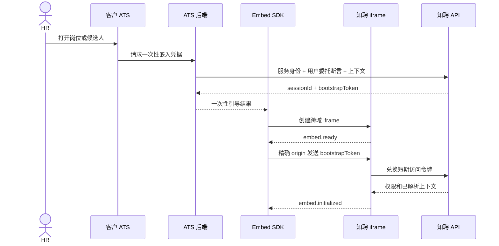

# 招聘智能体 ATS 宿主嵌入契约

> 文档状态：后续集成预留；不属于当前独立智能体验收范围
> 契约版本：`v1`
> 适用对象：客户 ATS 前端/后端、前端、后端、安全、实施和测试

## 1. 定位与边界

本契约描述独立智能体核心闭环验收后的 ATS 嵌入形态。当前生产主入口是独立 Web 工作台；客户 ATS 在后续集成阶段提供入口和业务上下文，知聘服务端继续拥有智能体编排、知识、检索、评价、人工门禁和审计状态。

首期采用“跨域 iframe + 轻量 Embed SDK”：

- SDK 负责创建和销毁 iframe、会话引导、上下文、主题、宿主导航和消息握手。
- React 应用运行在独立 iframe 内，不将候选人数据或业务状态放入宿主 JavaScript 上下文。
- Web Component 可包装 SDK，但内部仍使用 iframe。
- 独立应用保留为演示、重新认证和故障降级入口，与嵌入形态共用服务端状态。

直接 DOM 注入、通用 Module Federation 和浏览器扩展不是首期默认方案。受管浏览器扩展只在 ATS 没有稳定扩展点且客户书面批准时使用，也不得绕过 ATS 权限。

## 2. 组件关系



## 3. SDK 接口

```ts
const client = await SmartAIEmbed.init({
  container: '#smartai-panel',
  embedOrigin: 'https://smartai.customer.example',
  tokenProvider: ({ reason, sessionId }) => hostApi.createSmartAiBootstrapToken({ reason, sessionId }),
  context: {
    scene: 'job',
    enterpriseRef: { system: 'customer-ats', id: 'ORG-01' },
    taskRef: { system: 'customer-ats', id: 'T-1001', version: 3 },
    jobRef: { system: 'customer-ats', id: 'J-2001', version: 7 },
    candidateRef: { system: 'customer-ats', id: 'C-3001' },
    applicationRef: { system: 'customer-ats', id: 'A-4001', version: 2 },
    contextVersion: 1,
    nonce: crypto.randomUUID(),
    expiresAt: new Date(Date.now() + 10 * 60 * 1000).toISOString()
  },
  initialRoute: 'talent',
  hostCapabilities: ['CONTEXT_PUSH', 'HOST_NAVIGATION', 'AUTH_REFRESH'],
  theme: { mode: 'light', brandColor: '#087f7a', density: 'compact' },
  onEvent(event) {}
});

client.setContext(nextContext);
client.navigate(route);
client.setTheme(theme);
client.openStandalone();
client.destroy();
```

当前仓库在 `packages/embed-sdk/` 提供带 TypeScript 声明的 ESM 实现，并以 `SmartAIEmbed.init` 作为客户公共入口；`createSmartAIEmbed` 只用于同仓库联调台。UMD、CDN 发布和 SRI 清单属于正式 SDK 发布任务，在完成前不得把源码入口作为生产 CDN 资源。生产必须固定 SemVer 版本，不得自动使用 `latest`。

`apps/host-harness/` 是无后端的协议与布局模拟台，只能使用显式 `demoMode`，界面必须持续标记为“协议模拟会话”。模拟台中的“连接”“续期”“上下文接收”只演示消息时序，不代表 ATS 后端真实签发令牌、平台完成服务端认证或资源鉴权。生产构建在非指定演示域名上不接受该模式，且未完成 `token-exchange`、权限交集和资源映射前不得发送 `embed.initialized` 或展示业务数据。

## 4. 会话与令牌

1. 用户先登录客户 ATS。
2. ATS 后端以服务身份和当前用户委托断言调用 `POST /api/embed/v1/sessions`。
3. 平台校验租户、用户映射、允许的父页面 Origin、上下文范围和权限。
4. 平台返回 `sessionId`、`embedUrl` 和 30 至 60 秒内单次有效的 `bootstrapToken`。
5. iframe 就绪后，SDK 通过精确 `targetOrigin` 传递令牌并建立 `MessageChannel`。
6. iframe 将接收 `host.init` 时由浏览器 `event.origin` 观察到的父页面 Origin 作为 `observedParentOrigin`，调用 `POST /api/embed/v1/token-exchange`。平台将其与 Embed Session 绑定的纯 HTTPS Origin 精确比对后，换取 5 至 10 分钟访问令牌和 `HostContextResolution`；成功响应同时以 `ETag` 返回当前活动会话版本。
7. 令牌到期前 iframe 请求宿主刷新，SDK 再从 ATS 后端取得一次性令牌。

访问令牌仅保存在 iframe 内存，不进入 URL、Cookie、`localStorage`、日志或埋点。方案不依赖第三方 Cookie，浏览器不持有服务账号凭据和 Refresh Token。

令牌至少绑定 `aud=smartai-embed`、`tenant_id`、`sub`、`session_id`、`embed_client_id`、`host_origin`、`scopes`、`jti`、`nonce` 和短期 `exp`。人的身份优先采用 OAuth 2.0 Token Exchange；客户只提供 SAML/LDAP 时，由 ATS 后端终止登录后生成受信用户断言。

## 5. HostContext

宿主只传不可变资源引用和界面提示：

| 字段 | 含义 |
| --- | --- |
| `scene` | 当前宿主场景：`job`、`candidate` 或 `task` |
| `enterpriseRef` | 可选的客户企业/组织外部引用，不作为租户身份凭据 |
| `jobRef` | 当前 ATS 岗位外部引用和版本 |
| `taskRef` | 可选的 ATS 招聘任务引用 |
| `candidateRef` | 可选的候选人引用 |
| `applicationRef` | 可选的应聘关系引用 |
| `hostRoute`、`returnIntent` | 宿主位置与返回意图，不直接接受任意 URL |
| `contextVersion`、`nonce`、`expiresAt` | 防止旧上下文和重放 |
| `locale`、`timeZone`、`theme` | 白名单显示配置 |

`tenant/user/scopes/host_origin` 只能来自签名令牌。所有资源引用必须经 `ExternalIdentity` 解析并重新执行租户、组织和资源权限校验。消息中禁止传姓名、联系方式、简历正文、面试转写、提示词或完整业务结果。

上下文无权、过期或无法解析时必须清空旧详情并安全失败，不得猜测岗位或继续展示上一个候选人。

`HostContext` 在 SDK、会话创建和服务端解析结果中统一使用 `scene`、`enterpriseRef`、`jobRef`、`taskRef`、`candidateRef`、`applicationRef`、路由提示、版本、nonce、有效期、语言和时区。`HostContextResolution` 在此基础上增加 `resolutionId`、`observedParentOrigin`、`contextHash`、内部 `resolvedRefs` 和 `resolvedAt`；它不是新的身份凭据。

生产环境处理 `context.replace` 时必须经过服务端：

1. iframe 从已校验的 `MessageChannel` 收到新的 `HostContext`，但不立即展示新业务数据。
2. iframe 调用 `POST /api/embed/v1/sessions/{sessionId}/context-resolutions`，提交新上下文和本次消息实际观察到的 `observedParentOrigin`。
3. 平台重新执行 Origin、租户、组织、资源映射、数据范围、版本和 nonce 校验，返回短期 `resolutionId/contextHash`，并在响应 `ETag` 中再次返回未被本次解析改变的当前活动会话版本。
4. iframe 使用第 3 步返回的 ETag 调用 `PUT /api/embed/v1/sessions/{sessionId}/context`。平台原子替换活动上下文并返回新 ETag 后，iframe 才能发送 `context.accepted` 并展示新数据。
5. 任何一步失败都清空旧详情并发送 `context.rejected`；不得仅凭宿主消息在前端本地接受生产上下文。

嵌入 API 的错误状态遵循统一语义：`400` 为请求校验失败，`401` 为身份或一次性令牌无效，`403` 为 Origin、scope 或资源权限拒绝，`404` 为会话或映射不可见，`409` 为重放、幂等或版本冲突，`410` 为令牌、会话或解析结果已过期，`428` 为缺少 `If-Match`，`429` 为限流；`500/503/504` 分别表示平台内部错误、依赖不可用和上游超时。所有错误使用统一 `ErrorEnvelope`，可重试响应通过 `Retry-After` 给出建议等待时间。

## 6. 消息信封

```json
{
  "protocol": "smartai.embed",
  "protocolVersion": "1.0",
  "sessionId": "ses_...",
  "messageId": "msg_...",
  "replyTo": null,
  "type": "context.replace",
  "sequence": 12,
  "sentAt": "2026-07-30T14:30:00+08:00",
  "payload": {}
}
```

宿主到 iframe：`host.init`、`context.replace`、`theme.update`、`route.open`、`visibility.change`、`session.renew.response`、`destroy`。

iframe 到宿主：`embed.ready`、`embed.initialized`、`context.accepted`、`context.rejected`、`navigation.requested`、`route.changed`、`action.completed`、`dirty.changed`、`session.renew.request`、`resize.request`、`error`。

双方校验 Origin、`event.source`、会话、Schema、消息大小、时间窗口和递增序号。禁止 `targetOrigin="*"`。有请求语义的消息必须以同一 `messageId` 作为 `replyTo` 返回结果。

`postMessage` 只用于 UI 协作，不能代表上下文已获服务端授权，也不能代表确认岗位方案、确认名单、淘汰或录用等领域命令；生产上下文替换和业务写入必须调用服务端 API 并重复执行 Origin、RBAC、数据范围、状态机、版本和幂等校验。

## 7. 能力协商

宿主能力包括 `CONTEXT_PUSH`、`HOST_NAVIGATION`、`AUTH_REFRESH`、`AUTO_RESIZE`、`DOWNLOAD_DELEGATE`、`OPEN_STANDALONE` 和 `THEME_TOKENS`。

业务连接器能力仍由[客户系统集成契约](./integration-contract.md)定义。最终有效能力为：

`令牌 scope ∩ 平台 RBAC/数据范围 ∩ 资源权限 ∩ 宿主能力 ∩ 连接器能力 ∩ 人工门禁`

初始化结果返回 `required`、`supported`、`effective`、`missing` 和 `knownLimitations`。缺少必需能力时终止初始化；缺少可选能力时隐藏或禁用动作并说明替代路径。

## 8. 导航、主题与布局

- 跳转 ATS 页面时，iframe 发送资源引用和导航意图，由宿主生成真实 URL，防止开放重定向。
- 独立打开时调用 `POST /api/embed/v1/deep-links` 获取 60 秒单次有效的 opaque HTTPS 地址，URL 不含令牌和候选人信息。
- 主题只接受品牌色、表面色、文字色、边框、密度、圆角和字体枚举；禁止任意 CSS、HTML、脚本和字体 URL。
- 工作区使用固定容器高度，iframe 内只有一个主滚动容器。小屏切换为宿主内全屏或独立窗口，避免宿主与 iframe 双滚动。

侧栏适合岗位摘要、单候选人解释、待确认和运行状态；名单比较、面试批次、知识库和审计使用 ATS 内全页工作区。

## 9. 安全基线

- 每个 `EmbedClient` 配置精确 `allowed_parent_origins`。
- iframe 响应的 CSP `frame-ancestors` 和宿主 CSP `frame-src` 均使用精确 Origin。
- Embed 页面不得发送 `X-Frame-Options: DENY` 或 `SAMEORIGIN`，也不使用已废弃的 `ALLOW-FROM`；以 CSP `frame-ancestors` 作为唯一祖先控制。非嵌入页面仍可使用严格 XFO。
- CORS 不使用通配符；宿主 iframe 固定使用 `sandbox="allow-scripts allow-forms allow-downloads allow-same-origin"`，不包含任何 `top-navigation` 权限。
- Embed 页面设置 `Referrer-Policy: strict-origin-when-cross-origin`，敏感资源下载使用一次性签名 URL 和 `no-referrer`。
- Permissions Policy 默认禁用摄像头、麦克风、定位和非必要剪贴板权限。
- SDK 和协议版本不兼容时 fail closed，并提供重试或独立打开。
- 宿主 XSS、伪造 Origin、消息重放、令牌重放、跨租户上下文和点击劫持纳入安全测试。
- 宿主关闭面板或切换路由不取消服务端运行；未保存编辑由 `dirty.changed` 驱动离开确认。

## 10. 降级与错误

错误事件包含 `code`、`recoverable`、`retryAfter`、`traceId` 和 `fallbackAction`，不包含敏感载荷。

1. 短暂错误受控重试。
2. 可选能力缺失时禁用对应动作。
3. 身份过期时暂停敏感操作并请求刷新。
4. 上下文无权或失效时清空详情。
5. 初始化超过 8 秒或版本不兼容时提供重试和独立打开。
6. 服务不可用时只展示明确标记时间的只读状态，不把缓存伪装成实时数据。

## 11. MVP 验收

- 试点 ATS 岗位和候选人页一次点击进入正确上下文。
- 有效 ATS 会话下二次登录次数为 0。
- 上下文映射正确率和越权上下文阻止率均为 100%。
- 关闭重开、侧栏与全页切换、宿主前进后退后，服务端状态恢复率 100%，重复业务命令为 0。
- 在有效 ATS 会话、受支持客户端和正常网络条件下，插件壳初始化成功率不低于 99.5%，P95 不高于 3 秒；失败时独立页降级成功率 100%。
- 在第三方 Cookie 禁用、伪造 Origin、消息/令牌重放和协议不兼容场景下安全失败。
- 1280、1440、1920 宿主宽度无内容遮挡、双横向滚动和无法返回宿主页问题。
