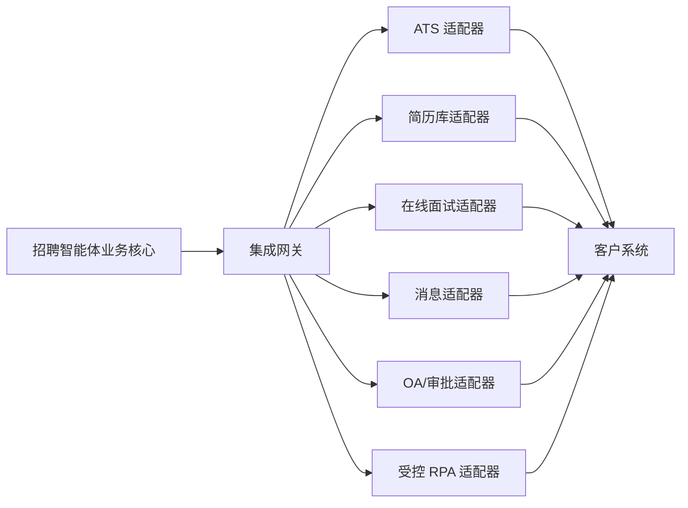

# 招聘智能体平台集成契约

> 文档状态：MVP 基线  
> 契约版本：`v1`  
> 适用范围：客户 ATS、简历库、在线面试、短信/邮件和 OA/审批系统的数据接入

本文件定义服务端数据连接器；ATS 页面内的 iframe、SSO、宿主上下文和 UI 消息见[ATS 宿主嵌入契约](./embed-contract.md)。两类协议不得混用。

## 1. 目标与边界

本契约定义招聘智能体平台与客户既有系统之间的标准资源、接口行为和适配责任。平台内部只依赖本契约，不直接依赖任何一家客户系统的字段、状态或接口协议；客户差异由适配层消化。

MVP 的集成目标是跑通以下闭环：

1. 从 ATS 获取招聘需求和岗位，或将人工确认后的岗位方案回写 ATS。
2. 从一个试点简历来源同步候选人和简历，并执行检索、匹配和证据提取。
3. 将人工确认的候选名单发送至在线面试系统，回收邀约和面试结果。
4. 通过短信、邮件或企业消息渠道发送通知并回收送达状态。
5. 客户将岗位或名单审批纳入试点且提供接口时，提交 OA 并同步结果；否则使用可审计人工门禁。录用和 Offer 审批不纳入 MVP，始终移交客户既有流程。

智能体不得绕过人工确认直接发布岗位、淘汰候选人、决定录用或发放 Offer。所有外部写操作必须关联招聘任务、操作者或授权规则，并写入审计日志。

## 2. 总体结构



边缘 API Gateway/WAF 负责入口鉴权、流量保护和请求追踪；业务核心的 `integration` 模块负责幂等、重试、协议转换、字段映射、脱敏和连接器编排；客户连接器负责供应商协议。各层只产生审计事件，只有 `audit` 模块持久化不可变审计事实。每个连接器通过能力矩阵声明实际支持范围。

## 3. 适配层职责

| 适配器 | 读取能力 | 写入能力 | 关键约束 |
| --- | --- | --- | --- |
| ATS | 组织、岗位、招聘任务、候选阶段、审批状态 | 创建/更新岗位、更新候选阶段、回写评价 | 客户状态必须映射到平台标准状态；写入前检查人工确认 |
| 简历库 | 候选人、简历正文、附件、更新时间、授权范围 | 写回标签或推荐结果（可选） | 只同步获授权字段；附件使用短时下载地址或加密流 |
| 在线面试 | 面试模板、场次、状态、转写、评分结果 | 创建邀请、取消、重发、更新截止时间 | 创建邀请前必须有候选名单确认记录 |
| 消息 | 模板、渠道能力、送达状态 | 发送短信、邮件、企业消息和提醒 | 联系方式按最小权限解密；模板内容留档 |
| OA/审批 | 流程模板、审批实例、节点和结果 | 发起、撤回、催办（按客户能力） | 审批结果通过 Webhook 或增量查询同步，不代替审批人决策 |

每个适配器必须实现健康检查、凭据轮换、请求追踪、错误归一化和能力查询；可选能力不得通过硬编码假定存在。

## 4. 通用协议

### 4.1 基础规则

- 协议：外部标准接口优先使用 HTTPS + JSON；批量文件交换使用 SFTP 或客户认可的对象存储。
- 路径：`/api/integration/v1/{tenantId}/...`。
- 编码：UTF-8；时间使用 ISO 8601，并保留时区，例如 `2026-07-30T14:30:00+08:00`。
- 标识：平台资源使用 UUID；客户资源标识写入 `externalRef.system` 和 `externalRef.id`。
- 分页：游标分页，参数为 `cursor`、`limit`，默认 50，最大 200。
- 增量同步：使用 `updatedAfter` 和稳定游标，不以本地当前时间替代源系统更新时间。
- 版本：破坏性变更发布新主版本；兼容字段只允许新增，不改变既有语义。

### 4.2 请求上下文

所有请求应包含：

```http
Authorization: Bearer <token>
X-Tenant-Id: <tenant-id>
X-Request-Id: <uuid>
X-Correlation-Id: <recruitment-task-or-workflow-id>
Idempotency-Key: <uuid>  # 写请求必填
```

禁止信任仅来自请求体的租户标识。网关必须校验令牌、请求头和资源所属租户一致。

### 4.3 响应封装

```json
{
  "requestId": "72ef853a-65ef-42e5-9fb3-4f0f5f8ec8d6",
  "data": {},
  "meta": {
    "nextCursor": null,
    "sourceSystem": "customer-ats",
    "syncedAt": "2026-07-30T14:30:00+08:00"
  }
}
```

列表的 `data` 必须是数组。错误响应使用第 10 节定义的统一结构。

## 5. 标准资源

| 资源 | 必要字段 | 说明 |
| --- | --- | --- |
| `Organization` | `id`、`name`、`parentId`、`status`、`externalRef` | 组织和用人部门 |
| `Job` | `id`、`title`、`departmentId`、`description`、`requirements`、`status`、`version` | ATS 岗位投影；映射到内部 `PositionPlanVersion`，不直接作为领域聚合 |
| `RecruitmentTask` | `id`、`jobRef`、`ownerId`、`businessStage`、`lifecycleStatus`、`executionStatus`、`pendingCheckpointRef`、`version` | 平台任务投影；三层状态枚举以领域模型为准 |
| `Candidate` | `id`、`name`、`contactRef`、`consent`、`externalRef` | 联系方式默认使用受控引用，不在事件中明文传播 |
| `Resume` | `id`、`candidateId`、`version`、`textRef`、`attachmentRef`、`updatedAt` | 原文和附件分离存储，解析结果可追溯到版本 |
| `Application` | `id`、`candidateId`、`jobId`、`stage`、`status`、`version`、`updatedAt` | ATS 外部应聘关系，可选映射到内部 `TaskCandidate` |
| `TaskCandidate` | `id`、`taskId`、`candidateId`、`applicationRef`、`status`、`version` | 平台任务候选关系；没有 ATS Application 时也可存在 |
| `MatchResult` | `id`、`taskCandidateId`、`matchRunRef`、`resumeVersionRef`、`scorecardVersionRef`、`score`、`evidenceRefs`、`reviewStatus` | 固定评分卡结果和证据，不接受无依据自由分数 |
| `Interview` | `id`、`taskCandidateId`、`provider`、`status`、`deadline`、`inviteRef`、`version` | 在线面试邀请及执行状态；状态枚举以领域模型为准 |
| `InterviewResult` | `id`、`interviewId`、`version`、`validityStatus`、`scores`、`transcriptRef`、`sourcePayloadRef`、`completedAt` | 不可变结果版本；供应商评分仅作为外部证据 |
| `Message` | `id`、`channel`、`templateId`、`recipientRef`、`status`、`sentAt` | 消息内容和联系方式不进入普通日志 |
| `Approval` | `id`、`businessType`、`businessId`、`processCode`、`status`、`nodes` | MVP 仅映射岗位或候选名单审批实例 |
| `AuditEvent` | `id`、`actor`、`action`、`resourceRef`、`beforeRef`、`afterRef`、`occurredAt` | 不可变审计记录；敏感载荷使用加密引用 |

所有资源必须包含 `createdAt`、`updatedAt`；可被删除的资源还应包含 `deletedAt`、墓碑事件，或在该资源自身枚举明确支持时使用 `status=ARCHIVED`。枚举值未知时映射为 `UNKNOWN` 并保留源值，禁止静默丢弃。

### 5.1 数据权威与冲突

| 数据 | 权威来源 | 平台责任 | 冲突处理 |
| --- | --- | --- | --- |
| 组织、用户身份、ATS 岗位发布状态 | 客户身份源/ATS | 映射和缓存授权快照 | 外部高版本覆盖投影，不覆盖平台人工确认记录 |
| 岗位方案、评分卡、知识引用 | 知聘 PostgreSQL | 版本化和审计；按批准范围回写 ATS | 已批准版本不可被 ATS 同步原地覆盖，生成差异待办 |
| 候选人和简历原文 | 客户 ATS/人才库 | 保存不可变来源版本和解析产物 | 以来源版本更新，历史匹配继续引用旧版本 |
| `TaskCandidate`、匹配、门禁和智能体运行 | 知聘 PostgreSQL | 唯一业务事实源 | ATS Application 只映射，不反向覆盖平台运行状态 |
| ATS Application 阶段、审批节点和发布结果 | 客户 ATS/OA | 同步外部事实并按授权发命令 | 使用版本/`If-Match`；未知状态转人工，不做后写覆盖 |
| 面试邀请和供应商结果 | 在线面试系统为交付事实，知聘为编排事实 | 记录本地命令、外部版本和结果快照 | 通过查询/Webhook 对账，禁止状态倒退 |

每个字段映射必须声明 `authority`、`direction`、`externalVersionField` 和冲突策略；未声明字段默认只读，不允许双向同步。

## 6. 标准 API

### 6.1 连接与能力

| 方法 | 路径 | 用途 |
| --- | --- | --- |
| `GET` | `/connectors` | 查询租户连接器和启用状态 |
| `GET` | `/connectors/{connectorId}/capabilities` | 查询能力矩阵、限额和版本 |
| `POST` | `/connectors/{connectorId}/health-checks` | 执行连通性和权限检查 |
| `POST` | `/connectors/{connectorId}/sync-jobs` | 发起全量或增量同步任务 |
| `GET` | `/sync-jobs/{syncJobId}` | 查询进度、断点和错误摘要 |

### 6.2 ATS 与岗位

| 方法 | 路径 | 用途 |
| --- | --- | --- |
| `GET` | `/organizations` | 增量读取组织 |
| `GET` | `/jobs` | 增量读取岗位 |
| `POST` | `/jobs` | 创建人工已确认岗位 |
| `PUT` | `/jobs/{jobId}` | 按版本更新岗位 |
| `POST` | `/jobs/{jobId}/publish` | 发布岗位；必须携带确认或审批记录 ID |
| `GET` | `/applications` | 增量读取候选申请和阶段 |
| `PATCH` | `/applications/{applicationId}/stage` | 回写阶段；必须传入期望当前版本 |

### 6.3 候选人与简历库

| 方法 | 路径 | 用途 |
| --- | --- | --- |
| `GET` | `/candidates` | 按授权范围增量读取候选人 |
| `GET` | `/candidates/{candidateId}` | 读取候选人基础信息 |
| `GET` | `/candidates/{candidateId}/resumes` | 获取简历版本清单 |
| `GET` | `/resumes/{resumeId}` | 获取解析文本、元数据和附件引用 |
| `POST` | `/resume-searches` | 执行源系统检索；支持过滤条件和分页 |
| `POST` | `/applications/{applicationId}/match-results` | 可选：回写推荐标签、分数和报告引用 |

`POST /resume-searches` 的查询条件必须结构化，至少支持岗位/技能关键词、地点、年限、学历、更新时间和授权范围；不允许将模型生成的自由 SQL 发送至客户数据库。

### 6.4 在线面试

| 方法 | 路径 | 用途 |
| --- | --- | --- |
| `GET` | `/interview-templates` | 查询可用面试模板 |
| `POST` | `/interviews` | 创建面试邀请 |
| `GET` | `/interviews/{interviewId}` | 查询邀请和完成状态 |
| `POST` | `/interviews/{interviewId}/reminders` | 发送提醒 |
| `PATCH` | `/interviews/{interviewId}/deadline` | 修改截止时间 |
| `POST` | `/interviews/{interviewId}/cancel` | 取消邀请 |
| `GET` | `/interviews/{interviewId}/result` | 获取结果、评分和转写引用 |

### 6.5 消息

| 方法 | 路径 | 用途 |
| --- | --- | --- |
| `GET` | `/message-templates` | 查询客户已审批模板 |
| `POST` | `/messages` | 发送单条模板消息 |
| `POST` | `/message-batches` | 异步发送批量消息 |
| `GET` | `/messages/{messageId}` | 查询发送和送达状态 |

### 6.6 OA 与审批

| 方法 | 路径 | 用途 |
| --- | --- | --- |
| `GET` | `/approval-processes` | 查询可发起流程和字段定义 |
| `POST` | `/approvals` | 发起审批 |
| `GET` | `/approvals/{approvalId}` | 查询节点、处理人和结果 |
| `POST` | `/approvals/{approvalId}/reminders` | 催办（如客户允许） |
| `POST` | `/approvals/{approvalId}/withdraw` | 撤回未完成审批（如客户允许） |

## 7. Webhook

外部系统应优先通过 Webhook 推送状态变化；不支持 Webhook 时使用增量轮询。

### 7.1 订阅接口

- `POST /webhook-subscriptions`：创建订阅。
- `GET /webhook-subscriptions`：查询订阅。
- `DELETE /webhook-subscriptions/{id}`：停用订阅。

### 7.2 标准事件

| 事件 | 触发时机 |
| --- | --- |
| `job.updated`、`job.published` | 岗位变更或发布 |
| `candidate.updated`、`resume.updated` | 候选人或简历版本变化 |
| `application.stage_changed` | 候选阶段变化 |
| `interview.invited`、`interview.completed`、`interview.expired` | 面试关键状态变化 |
| `message.delivered`、`message.failed` | 消息送达或失败 |
| `approval.node_changed`、`approval.completed`、`approval.rejected` | 审批节点或最终结果变化 |

### 7.3 事件结构与校验

```json
{
  "eventId": "21c80a0d-a99a-45e6-91f7-d73da6ad59a4",
  "eventType": "interview.completed",
  "eventVersion": "1.0",
  "tenantId": "tenant-001",
  "occurredAt": "2026-07-30T14:30:00+08:00",
  "resource": { "type": "Interview", "id": "...", "version": 3 },
  "data": { "resultRef": "..." }
}
```

- 使用 `X-Webhook-Timestamp`、`X-Webhook-Signature`，按时间戳和原始请求体计算 HMAC-SHA256。
- 接收端先校验签名、租户和时间窗口，再按 `eventId` 去重。
- 接收成功返回 `2xx`；处理逻辑异步执行，不让耗时任务阻塞响应。
- 事件可能重复或乱序。消费端必须按资源版本判断，不能仅按到达顺序覆盖状态。
- 事件载荷不得包含完整简历、转写、手机号或身份证号，只提供受控资源引用。
- 外部事件先落 `WebhookReceipt`，再归一化为平台集成事件，最后由反腐层转换为领域命令或过去式领域事件；供应商事件名和状态不得直接进入核心聚合。

## 8. 认证与授权

优先级如下：

1. OAuth 2.0 Client Credentials + mTLS。
2. 客户 API 网关签发的短期令牌 + IP 白名单。
3. HMAC 签名请求，作为遗留系统兼容方式。
4. SFTP 密钥认证，仅用于受控批量文件交换。

每个连接器使用独立服务身份和最小权限，不共享管理员账号。凭据存入密钥管理服务，不进入代码、配置仓库、前端、日志或工单。生产凭据必须支持轮换、吊销和到期告警。

对人的访问复用客户 OIDC/SAML/LDAP 身份，平台 RBAC 至少区分招聘 HR、招聘负责人、用人经理、面试官、知识管理员、系统管理员和审计人员。数据权限同时受租户、组织、岗位和候选人授权范围约束。

## 9. 幂等与并发

- 所有 `POST`、`PUT`、`PATCH` 外部写请求必须携带 `Idempotency-Key`。
- 传输层幂等记录至少保留 72 小时；同一键和同一请求摘要返回首次结果，同一键但载荷不同返回 `409 IDEMPOTENCY_CONFLICT`。
- 更新资源必须携带 `version` 或 `If-Match`；版本冲突返回 `409 VERSION_CONFLICT`，禁止后写覆盖。
- 批量操作按子项返回结果；单个失败不得导致已成功外部调用被盲目重放。
- 智能体工作流另以数据库唯一的业务操作键保证端到端幂等，例如“租户 + 连接器 + 候选任务关系 + 面试模板版本”只创建一个有效邀请。该唯一性覆盖整个业务有效期，不随 72 小时传输记录到期。
- 对不可逆或费用型调用，重试前必须先查询源系统状态。

## 10. 错误码与重试

错误响应：

```json
{
  "requestId": "...",
  "error": {
    "code": "RATE_LIMITED",
    "message": "请求超过连接器限额",
    "retryable": true,
    "retryAfterSeconds": 30,
    "details": []
  }
}
```

| HTTP | 错误码 | 是否自动重试 | 处理原则 |
| --- | --- | --- | --- |
| 400 | `VALIDATION_FAILED`、`STATE_NOT_ALLOWED` | 否 | 修正字段或业务状态后人工重提 |
| 401/403 | `AUTH_FAILED`、`PERMISSION_DENIED` | 否 | 停用连接器并告警，核查凭据和授权 |
| 404 | `RESOURCE_NOT_FOUND` | 否 | 校验映射；增量同步可记录墓碑 |
| 409 | `VERSION_CONFLICT`、`IDEMPOTENCY_CONFLICT` | 否 | 拉取最新资源并进入人工或业务冲突处理 |
| 429 | `RATE_LIMITED` | 是 | 遵循 `Retry-After` |
| 500/502/503/504 | `UPSTREAM_UNAVAILABLE`、`TIMEOUT` | 是 | 指数退避并加入随机抖动 |
| 422 | `MAPPING_FAILED` | 否 | 进入死信队列和映射修复流程 |

自动重试默认最多 5 次，建议间隔为 2、5、15、45、120 秒；客户明确返回 `Retry-After` 时优先遵循。超过次数进入死信队列，生成可见告警并支持从失败步骤人工重放。不得无限重试，不得对权限、校验、版本冲突和明确业务拒绝自动重试。

## 11. 数据安全与脱敏

- 采集前记录处理目的、数据范围、授权依据和保留期限，只同步完成招聘任务所需字段。
- 传输使用 TLS 1.2 以上，存储采用客户认可的加密算法和密钥托管方式。
- 手机号、邮箱、证件号、住址等字段加密存储；普通页面和日志默认掩码展示。
- 简历正文、附件、面试转写和模型上下文按敏感数据处理，不进入 APM 错误正文、普通日志或 Webhook。
- 模型调用前按任务需要去除或替换联系方式、证件号等非评分必要信息；禁止使用生产候选人数据训练通用模型。
- 所有读取、导出、解密、模型调用、评分、人工修改和外部写入均记录操作者、目的、资源版本、时间和结果。
- 删除和归档按照客户保留策略执行，并向搜索索引、缓存、对象存储和下游系统传播删除状态。
- 测试环境只使用脱敏或合成数据；生产数据不得复制到个人设备或公共演示环境。

## 12. 能力矩阵

连接器必须返回机器可读的能力声明。试点前由客户和项目组共同确认下表：

| 能力 | 标准能力码 | MVP 要求 | ATS | 简历库 | 面试 | 消息 | OA |
| --- | --- | --- | --- | --- | --- | --- | --- |
| 增量读取 | `READ_INCREMENTAL` | 必须 | 是 | 是 | 是 | 可选 | 是 |
| Webhook | `WEBHOOK_EVENTS` | 至少关键状态支持 | 可选 | 可选 | 优先 | 优先 | 优先 |
| 创建岗位 | `JOB_CREATE` | 试点按场景 | 是 | - | - | - | - |
| 发布岗位 | `JOB_PUBLISH` | 人工门禁后 | 是 | - | - | - | 可审批 |
| 简历检索 | `RESUME_SEARCH` | 必须 | 可选 | 是 | - | - | - |
| 简历附件读取 | `RESUME_ATTACHMENT_READ` | 必须 | 可选 | 是 | - | - | - |
| 阶段回写 | `APPLICATION_STAGE_WRITE` | 必须 | 是 | 可选 | - | - | - |
| 创建面试 | `INTERVIEW_CREATE` | 必须 | - | - | 是 | - | - |
| 面试结果读取 | `INTERVIEW_RESULT_READ` | 必须 | - | - | 是 | - | - |
| 模板消息 | `MESSAGE_TEMPLATE_SEND` | 必须 | - | - | 可选 | 是 | - |
| 送达回执 | `MESSAGE_DELIVERY_STATUS` | 优先 | - | - | 可选 | 是 | - |
| 发起审批 | `APPROVAL_CREATE` | 按试点范围 | - | - | - | - | 是 |
| 审批结果 | `APPROVAL_RESULT_READ` | 按试点范围 | - | - | - | - | 是 |

能力响应还应包含 `supportedVersions`、`rateLimits`、`batchLimit`、`webhookEvents`、`dataScopes` 和 `knownLimitations`。平台前端根据声明禁用不支持的动作，并给出替代路径，不能等到调用失败才暴露限制。

## 13. RPA 兜底原则

RPA 仅用于客户系统短期无 API、试点又必须验证的低频场景，不作为平台标准集成的长期替代。

启用 RPA 必须同时满足：

1. 客户书面授权，明确目标系统、账号、数据范围和执行时段。
2. 使用专用最小权限服务账号，不复用个人账号，不绕过验证码、风控或安全控制。
3. 操作步骤可回放并保存截图、输入摘要、结果和失败节点；截图中的敏感信息需脱敏。
4. 每个写操作继续使用业务幂等键，并在执行前后查询页面状态，防止重复发布、重复邀请或重复审批。
5. 关键页面结构变化、登录失效、字段歧义或结果不确定时立即停止并转人工，不猜测点击。
6. 设定 API 替换期限、责任人和退出条件；稳定试点完成后优先改造为 API、Webhook 或受控文件交换。

禁止使用 RPA 批量下载超出授权范围的简历、规避权限隔离、自动作出录用决策或在无人监督下处理高风险不可逆操作。

## 14. 联调与验收

每个连接器上线前必须完成：

- 契约测试：字段、枚举、分页、版本、错误码和能力声明通过自动化校验。
- 沙箱测试：成功、超时、限流、重复请求、乱序事件、权限失效和部分失败场景覆盖。
- 对账测试：增量同步连续运行 7 天，核心资源数量、状态和更新时间可对账。
- 安全测试：凭据、租户隔离、越权、日志脱敏、附件访问和 Webhook 签名验证通过。
- 业务验收：岗位回写、候选检索、面试邀请和结果回收至少各跑通一个真实等价用例；OA 仅在试点能力矩阵纳入时验收岗位或名单审批状态。
- 运维交接：连接器负责人、限额、监控、告警、重试、死信处理和停用开关有明确文档。

上线门槛：外部写操作幂等率 100%，关键状态最终一致率不低于 99.9%，审计事件完整率 100%，不得存在未关闭的高危安全问题。
