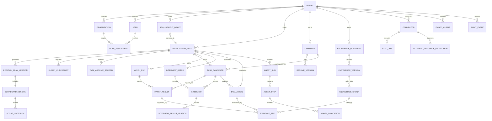
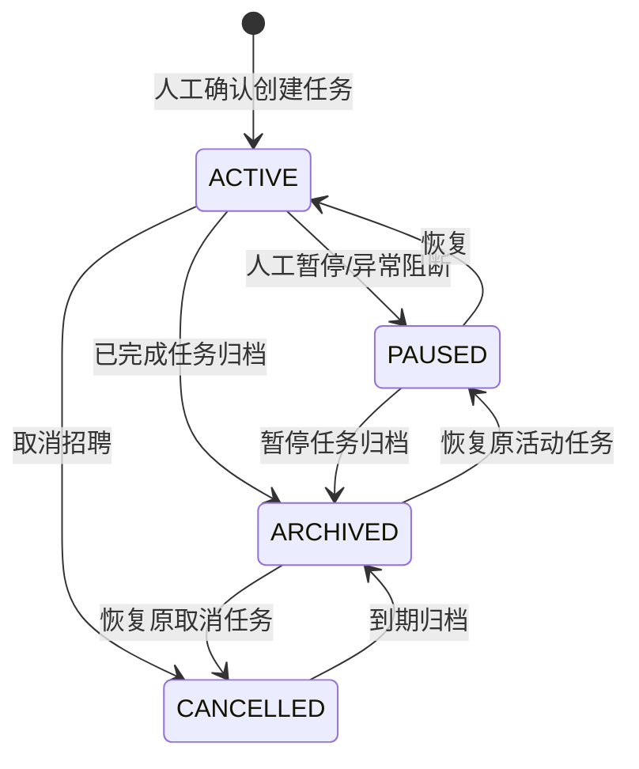
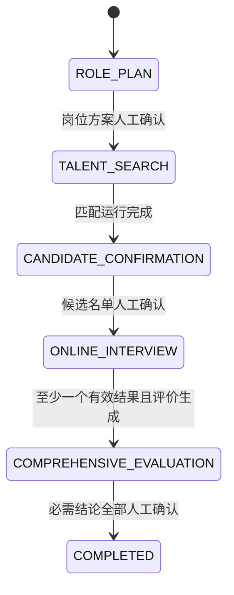
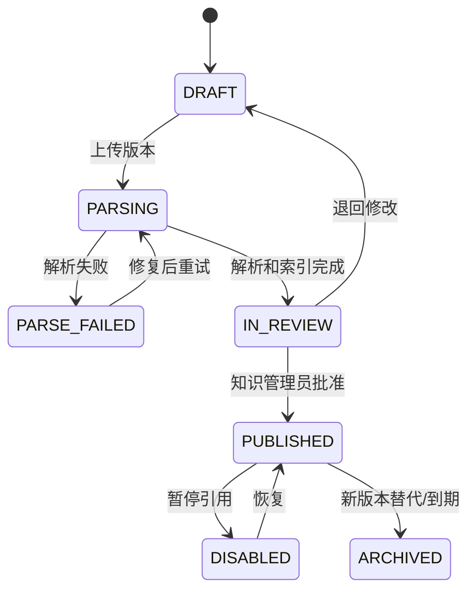

# 知聘领域模型

> 状态：领域基线 v0.1  
> 关联文档：[系统架构设计](./system-design.md)

## 1. 建模目标

本模型用招聘任务串联岗位方案、人才匹配、面试、综合评价、企业知识和智能体运行，服务于 PostgreSQL 模型、Java 聚合边界、OpenAPI 契约、领域事件以及客户连接器标准模型。

模型中的“候选人推荐”和“综合评价”均为辅助结论，不等于录用决定。

## 2. 通用约定

- 内部主键使用 UUIDv7，字段名为 `id`；业务对象同时保留可读编号，例如 `task_no`。
- 所有租户业务表必须包含 `tenant_id`，唯一约束以 `tenant_id` 开头。
- 可变聚合包含 `version` 乐观锁以及 `created_at/by`、`updated_at/by`。
- 时间统一用 UTC 的 `timestamptz` 存储，展示时按用户时区转换。
- 外部标识使用 `source_system + external_id` 或 `ExternalIdentity` 映射。
- 敏感字段按分类分级标识，不在日志、事件和搜索索引中默认展开。

任何进入推荐或评价的结论都应引用不可变版本：

- 岗位要求引用 `position_plan_version_id`。
- 评分引用 `scorecard_version_id`。
- 简历证据引用 `resume_version_id + source_locator`。
- 知识证据引用 `knowledge_version_id + chunk_id`。
- 面试证据引用 `interview_result_version_id + source_locator`。
- AI 产物引用 `agent_run_id + model_invocation_id + prompt_version`。

## 3. 限界上下文与聚合

| 限界上下文 | 聚合根 | 主要职责 |
| --- | --- | --- |
| 租户与身份 | `Tenant`、`User`、`RoleAssignment` | 企业空间、组织、身份映射、角色和数据范围 |
| 招聘任务 | `RequirementDraft`、`RecruitmentTask`、`PositionPlan` | 创建前草案、岗位方案、评分卡、状态机和人工确认 |
| 人才 | `Candidate`、`TaskCandidate`、`MatchRun` | 候选人、任务关系、简历版本、召回、证据和固定评分结果 |
| 面试评价 | `InterviewBatch`、`Evaluation` | 邀约、结果版本、综合评价和人工结论 |
| 企业知识 | `KnowledgeDocument` | 文件版本、解析、发布、索引和引用 |
| 智能体运行 | `AgentRun`、`HumanCheckpoint` | 运行步骤、模型调用、策略校验和人工门禁 |
| 集成 | `Connector`、`SyncJob`、`EmbedClient` | 数据连接、ATS 宿主配置、字段映射、同步、Webhook 和幂等 |
| 审计 | `AuditEvent` | 不可变操作与访问记录 |

聚合之间只通过 ID 引用。跨聚合一致性使用领域事件和最终一致性；只有聚合内部规则使用单数据库事务保证。

## 4. 核心关系图

图中 `EVIDENCE_REF` 是统一逻辑概念。数据库可按 `resume_evidence`、`knowledge_evidence`、`interview_evidence` 拆表，避免无约束的多态外键。

## 5. 租户与身份上下文

### 5.1 Tenant

聚合根，代表一个客户企业空间。

| 关键字段 | 含义 |
| --- | --- |
| `id`, `code`, `name` | 内部标识、稳定编码和企业名称 |
| `status` | `PROVISIONING`、`ACTIVE`、`SUSPENDED`、`TERMINATED` |
| `data_region`, `deployment_mode` | 数据地域与共享/专属部署模式 |
| `ai_policy_id`, `retention_policy_id` | 模型出口和数据保留策略 |
| `default_timezone`, `locale` | 默认时区与语言 |

租户停用后禁止新增业务写入和模型调用，但授权审计员仍可读取保留期内记录。

### 5.2 Organization、User 与 RoleAssignment

- `Organization`：`id`、`tenant_id`、`parent_id`、`code`、`name`、`path`、`status`、`external_id`。
- `User`：`id`、`tenant_id`、`identity_issuer`、`subject_id`、`display_name`、`email_ciphertext`、`status`、`last_login_at`。`(tenant_id, identity_issuer, subject_id)` 唯一，宿主传来的显示名和角色不能替代受信身份映射。
- `RoleAssignment`：`user_id`、`role_code`、`scope_type`、`scope_id`、`valid_from/to`、`granted_by`。

同一用户可以在集团和不同组织拥有不同角色。授权判断同时检查角色动作、组织数据范围、任务归属和资源敏感级别。

## 6. 招聘任务上下文

### 6.1 RequirementDraft

任务创建前的短期聚合根，字段包括 `tenant_id`、`created_by`、`host_context_snapshot`、`raw_input_ciphertext`、`extracted_fields`、`confidence`、`status`、`version`、`expires_at` 和 `converted_task_id`。状态为 `DRAFT`、`READY`、`CONVERTED`、`ABANDONED`、`EXPIRED`。

同一草案只能转换一次；确认命令使用稳定业务键。过期或放弃草案不产生正式任务，转换后保存输入快照和目标任务引用用于审计。

### 6.2 RecruitmentTask

聚合根，代表一次有明确岗位和人数目标的招聘执行单元。

| 关键字段 | 含义 |
| --- | --- |
| `id`, `tenant_id`, `task_no` | 主键、租户和可读任务编号 |
| `title`, `position_name`, `organization_id` | 任务名称、岗位和用人组织 |
| `recruitment_type`, `headcount`, `locations` | 招聘类型、人数和地点 |
| `owner_user_id`, `hiring_manager_id` | 招聘负责人和用人经理 |
| `priority`, `target_date` | 优先级与目标完成时间 |
| `raw_requirement` | HR 原始自然语言需求；加密存储并保留原文 |
| `current_plan_version_id` | 当前生效岗位方案版本 |
| `business_stage`, `lifecycle_status`, `version` | 业务阶段、生命周期和乐观锁；`execution_status` 由当前 `AgentRun` 投影，空闲时为 `IDLE` |
| `source_system`, `external_id` | 客户 ATS 映射 |

`task_no` 在租户内唯一。招聘岗位或用人组织发生实质变化时，应创建新方案版本；已开始匹配的历史运行仍引用旧版本。

### 6.3 任务状态机

`lifecycle_status` 表示生命周期，`business_stage` 表示业务推进阶段，两者分离。自然语言需求在用户确认创建前属于独立的 `RequirementDraft`，不提前创建 `RecruitmentTask`，因此任务生命周期不包含 `DRAFT`。

每次进入 `ARCHIVED` 创建不可变 `TaskArchiveRecord`，记录 `task_id`、归档前生命周期、归档时业务阶段、原因、操作者和时间；恢复只读取最近一条有效记录。原 `ACTIVE` 或 `PAUSED` 任务统一恢复为 `PAUSED`，原 `CANCELLED` 任务恢复为 `CANCELLED`。

禁止跳过两个强制门禁：`ROLE_PLAN -> TALENT_SEARCH` 和 `CANDIDATE_CONFIRMATION -> ONLINE_INTERVIEW`。完整状态语义、回退和补偿规则以 [招聘任务工作流](../product/workflow.md) 为准。

### 6.4 PositionPlan 与 Scorecard

`PositionPlan` 是逻辑聚合根，修改通过创建不可变 `PositionPlanVersion` 完成。

`PositionPlanVersion` 关键字段：

- `task_id`、`version_no`、`status`（`DRAFT`、`IN_REVIEW`、`APPROVED`、`SUPERSEDED`）。
- `job_description`、`responsibilities`、`requirements`、`hard_constraints`。
- `generated_by`（`AI`、`HUMAN`、`IMPORTED`）、`based_on_run_id`。
- `approved_by/at`、`content_hash`、`change_summary`。

`ScorecardVersion` 与岗位方案版本一对一冻结，包含 `total_score=100`、推荐阈值、缺失证据规则和敏感特征策略。`ScoreCriterion` 包含：

- `code`、`name`、`weight`、`description`、`evidence_requirement`。
- `scoring_rule`：结构化区间或表达式，不保存任意可执行代码。
- `required`、`cap_score`、`display_order`。

约束：同一评分卡所有权重合计必须为 100；阈值连续且不得重叠；已批准版本不可原地修改。

## 7. 人才上下文

### 7.1 Candidate 与 ResumeVersion

`Candidate` 是租户内候选人档案，不跨租户共享。

| 关键字段 | 含义 |
| --- | --- |
| `id`, `tenant_id` | 内部标识和租户 |
| `candidate_no` | 租户内可读编号 |
| `name_ciphertext`, `contacts_ciphertext` | 加密身份和联系方式 |
| `identity_fingerprint` | 租户密钥下的去重指纹，不能反解 |
| `consent_status`, `consent_at` | 授权状态和时间 |
| `source_system`, `external_id` | 候选人主数据来源 |
| `status`, `retention_until` | `ACTIVE`、`RESTRICTED`、`ANONYMIZED` 与保留期限 |

`ResumeVersion` 为不可变实体，关键字段包括 `candidate_id`、`version_no`、`object_key`、`sha256`、`mime_type`、`language`、`parser_version`、`parse_status`、`parsed_object_key`、`source_updated_at`。同一文件哈希在租户和候选人范围内不重复解析。

### 7.2 TaskCandidate

`TaskCandidate` 表示平台招聘任务与候选人的业务关系，从候选人被某次匹配运行纳入候选集时创建，不要求客户 ATS 已存在正式应聘记录。

- 唯一键为 `task_id + candidate_id`，并保存 `source_application_ref` 作为可选外部映射。
- 字段包括 `status`、`current_match_result_id`、`selection_status`、`candidate_list_version_id`、`source_type` 和 `version`。
- ATS `Application` 是外部投影，可映射到 `TaskCandidate`，但不能作为平台内部匹配和面试的必需外键。

### 7.3 MatchRun

聚合根，表示一次可复现的人才匹配作业。

| 关键字段 | 含义 |
| --- | --- |
| `task_id`, `position_plan_version_id`, `scorecard_version_id` | 冻结业务输入 |
| `candidate_scope_snapshot` | 人才池范围、筛选条件和数据截止时间 |
| `search_index_version`, `pipeline_version` | 索引与算法流水线版本 |
| `status` | `QUEUED`、`RUNNING`、`SUCCEEDED`、`PARTIAL`、`FAILED`、`CANCELLED` |
| `requested_by`, `started_at`, `finished_at` | 发起人与时点 |
| `metrics` | 过滤、召回、重排、失败和耗时统计 |
| `idempotency_key` | 防止同一输入重复创建运行 |

### 7.4 MatchResult 与证据

`MatchResult` 属于 `MatchRun`，包含 `task_candidate_id`、`resume_version_id`、`rank`、`total_score`、`recommendation_level`、`hard_filter_result`、`confidence` 和 `review_status`。

每个评分项保存 `CriterionScore`：

- `criterion_code`、`raw_score`、`weighted_score`、`calculation_version`。
- `evidence_status`：`SUPPORTED`、`INSUFFICIENT`、`CONFLICTING`、`HUMAN_PROVIDED`。
- 一个或多个证据引用；非零 AI 评分必须至少有一个可定位证据。

`EvidenceRef` 包含 `source_type`、不可变源版本 ID、`source_locator`（页码/段落/字符区间/时间戳）、`quote`、`quote_hash`、`extraction_confidence`、`model_invocation_id` 和 `verified_by/at`。展示时再次校验租户和源文件读取权限。

## 8. 面试与评价上下文

### 8.1 InterviewBatch 与 Interview

`InterviewBatch` 聚合根字段包括 `task_id`、`name`、`type`、`provider_connector_id`、`deadline`、`status` 和 `confirmed_checkpoint_id`。只有候选名单门禁通过后才能创建。

`Interview` 是批次内实体：

- `task_candidate_id`、`invitation_id`、`channel`、`provider_interview_id`。
- `status`：`DRAFT`、`PENDING_SEND`、`SENT`、`DELIVERED`、`OPENED`、`IN_PROGRESS`、`COMPLETED`、`EXPIRED`、`DECLINED`、`CANCELLED`、`FAILED`。
- `invited_at`、`completed_at`、`last_reminded_at`、`failure_code`。
- 外部写操作幂等键和供应商状态版本。

状态只能单向推进；`COMPLETED`、`EXPIRED`、`DECLINED`、`CANCELLED` 和 `FAILED` 为终态。发送失败使用 `FAILED + failure_code=DELIVERY_FAILED`；结果有效性由 `InterviewResultVersion.validity_status` 表达。乱序 Webhook 根据供应商版本或事件时间处理，不得把 `COMPLETED` 回退到 `IN_PROGRESS`。

### 8.2 InterviewResultVersion

面试结果更新时创建新版本，包含 `interview_id`、`version_no`、`provider_payload_hash`、`transcript_object_key`、`structured_answers`、`provider_scores`、`received_at` 和 `validity_status`。供应商分数只作为外部证据，不直接覆盖平台评分卡。

### 8.3 Evaluation

聚合根，以 `task_candidate_id` 在有效状态下唯一：

- 输入快照：`match_result_id`、`interview_result_version_ids`、`scorecard_version_id`。
- 结果：`resume_score`、`interview_score`、`assessment_score`、`final_score`、`strengths`、`risks`。
- 状态：`DRAFT`、`GENERATED`、`IN_REVIEW`、`CONFIRMED`、`SUPERSEDED`。
- 人工结论：`decision`（`ADVANCE`、`HOLD`、`REJECT`）、`decision_reason`、`confirmed_by/at`。

`decision` 只能由具备权限的人员写入。AI 可以生成 `suggested_decision`，但该字段必须与人工结论分开存储和展示。结论改变时创建修订版本并保留旧版本，不覆盖原审计证据。

## 9. 企业知识上下文

### 9.1 KnowledgeDocument

聚合根，代表一个逻辑资料条目。

| 关键字段 | 含义 |
| --- | --- |
| `id`, `tenant_id`, `title` | 标识与标题 |
| `type` | `JOB_KNOWLEDGE`、`TALENT_PROFILE`、`POLICY_PROCESS`、`EVALUATION_STANDARD` |
| `owner_org_id`, `classification` | 维护组织和密级 |
| `status` | `DRAFT`、`IN_REVIEW`、`PUBLISHED`、`DISABLED`、`ARCHIVED` |
| `current_version_id` | 当前发布版本 |
| `access_policy_id`, `retention_until` | 访问和保留策略 |

### 9.2 KnowledgeVersion 与 KnowledgeChunk

`KnowledgeVersion` 不可变，包含 `version_no`、`object_key`、`sha256`、`mime_type`、`parser_version`、`parse_status`、`index_status`、`content_hash`、`effective_from/to`、`approved_by/at`。

`KnowledgeChunk` 是派生数据，包含 `version_id`、`chunk_no`、`text`、`source_locator`、`embedding_model`、`embedding_version`、`metadata`。正文和向量位于 OpenSearch 时，PostgreSQL 至少保留 chunk ID、哈希和定位信息以支持引用校验。

只有 `PUBLISHED` 且在有效期内、调用者有权访问的版本可以进入检索。历史运行继续引用当时版本，即使其后被停用；若因合规要求删除正文，审计中保留哈希、元数据和删除原因。

## 10. 智能体运行与人工门禁

### 10.1 AgentRun、AgentStep 与 ModelInvocation

`AgentRun` 聚合根表示一次编排执行：

- `tenant_id`、`task_id`、`run_type`、`workflow_version`、`requested_by`。
- `status`：`QUEUED`、`RUNNING`、`WAITING_HUMAN`、`SUCCEEDED`、`FAILED_RETRYABLE`、`FAILED_FINAL`、`CANCEL_REQUESTED`、`CANCELLED`。任务级 `execution_status=IDLE` 表示当前没有活动运行，不创建空 `AgentRun`。
- `input_snapshot_ref`、`policy_snapshot`、`trace_id`、`started_at/finished_at`。
- `idempotency_key`、`retry_of_run_id`、`failure_code/message`。

`AgentStep` 包含 `step_code`、`sequence`、`status`、`attempt`、`input_hash`、`output_ref`、`started_at/finished_at`。可重试步骤必须声明副作用类型；有外部副作用的步骤不能仅凭异常自动重放。

每个任务同一时刻最多一个 `run_scope=PRIMARY` 的活动 `AgentRun`，数据库使用部分唯一索引约束。候选人级并行处理使用 `run_scope=CHILD + parent_run_id`，子运行不直接投影任务状态；主运行根据子运行结果显式更新自身状态。任务 `execution_status` 只投影主运行，避免并行子任务在 `RUNNING`、`WAITING_HUMAN` 和失败状态间互相覆盖。

`ModelInvocation` 记录 `provider`、`model`、`model_revision`、`prompt_template/version`、`parameters`、输入输出摘要、敏感处理策略、token、延迟、费用、结构校验结果和 `trace_id`。原始正文只在租户策略允许时加密留存。

### 10.2 HumanCheckpoint

独立聚合根，避免智能体运行事务长时间等待：

| 字段 | 含义 |
| --- | --- |
| `task_id`, `checkpoint_type` | 任务与门禁类型 |
| `resource_type/id/version` | 待确认对象及冻结版本 |
| `status` | `PENDING`、`APPROVED`、`REJECTED`、`EXPIRED`、`CANCELLED` |
| `required_role`, `assignee_user_id` | 审批角色与指定处理人 |
| `decision`, `comment`, `decided_by/at` | 人工决定和理由 |
| `request_hash`, `idempotency_key` | 防止页面重复确认 |

门禁决定不可修改；需要改变时取消原门禁并创建新门禁。批准动作必须校验资源版本，防止用户确认已被后台更新的旧内容。

## 11. 集成上下文

### 11.1 Connector、SyncJob 与 ExternalIdentity

`Connector` 聚合根字段包括 `type`、`vendor`、`name`、`status`、`capabilities`、`base_url`、`credential_ref`、`field_mapping_version`、`rate_limit_policy`、`last_health_at`。密钥仅保存引用，不保存明文。

`SyncJob` 记录 `connector_id`、`job_type`、`cursor`、`range_from/to`、`status`、`items_total/succeeded/failed`、`started_at/finished_at` 和错误报告对象键。失败条目可单独重试。

`ExternalIdentity` 统一映射 `(tenant_id, connector_id, object_type, external_id)` 到内部对象；该组合唯一，防止不同系统或租户发生标识碰撞。

`ExternalResourceProjection` 保存外部权威事实的本地只读投影：`connector_id`、`object_type`、`external_ref`、`external_version`、`normalized_status`、`payload_hash`、`payload_ref`、`source_updated_at`、`observed_at` 和 `sync_job_id`。岗位发布状态、ATS Application 阶段和 OA 审批结果写入该实体，不写入不可变岗位方案或平台任务候选状态；平台命令通过显式映射读取投影并处理冲突。

### 11.2 EmbedClient、EmbedSession 与 HostContextSnapshot

`EmbedClient` 是 ATS 宿主配置聚合，字段包括 `client_id`、`tenant_id`、`allowed_parent_origins`、`auth_mode`、`allowed_scopes`、`theme_policy`、`navigation_policy`、`protocol_versions`、`status` 和 `key_ref`。

`EmbedSession` 为短期安全会话，包含用户、宿主 Origin、协议版本、一次性令牌状态和上下文哈希；活动态存 Redis，PostgreSQL 只保留创建、续期、关闭和异常审计元数据。

`HostContextSnapshot` 是不可变值对象，保存已解析的岗位、任务、候选人和应聘关系引用、外部版本、宿主路由意图与哈希。宿主字段只用于定位，必须经 `ExternalIdentity` 映射和资源权限校验，不能直接授予角色或数据权限。

### 11.3 幂等与事件表

- `IdempotencyRecord`：传输层记录 `tenant_id`、`scope`、`idempotency_key`、`request_hash`、`status`、`response_ref`、`expires_at`；用于处理同一 HTTP 请求重放，同一键不同请求哈希返回冲突。
- `BusinessOperation`：副作用业务唯一键，例如 `(tenant_id, connector_id, operation, task_candidate_id, template_version)`；在业务有效期内保持唯一，不能因传输层幂等记录到期而重复邀请、发布或回写。
- `InboxMessage`：消费者、消息 ID、处理结果和时间，唯一键为 `(consumer, message_id)`。
- `OutboxEvent`：聚合类型/ID/版本、事件类型、Schema 版本、载荷、创建和发布时间。
- `WebhookReceipt`：连接器、供应商事件 ID、签名结果、原始载荷对象键和处理状态。

外部 Webhook 先归一化为带来源事件 ID、资源版本和原始载荷引用的集成事件，再由反腐层映射为内部领域命令或事件；禁止供应商状态直接写入核心聚合。领域事件命名使用过去式，例如 `PositionPlanApproved.v1`、`MatchRunCompleted.v1`、`CandidateListConfirmed.v1`、`InterviewResultReceived.v1`。事件 Schema 只增字段，不复用字段改变语义。

## 12. 审计上下文

`AuditEvent` 为追加写实体：

- 主体：`actor_type`（`USER`、`AGENT`、`SYSTEM`、`CONNECTOR`）、`actor_id`、`impersonator_id`。
- 对象：`resource_type`、`resource_id`、`resource_version`、`task_id`。
- 行为：`action`、`outcome`、`reason_code`、`occurred_at`。
- 环境：`trace_id`、`request_id`、`ip_hash`、`user_agent_hash`。
- 嵌入环境：`embed_client_id`、`embed_session_id`、`parent_origin`、`host_context_hash`、`protocol_version`。
- 变更：脱敏后的 `before_summary`、`after_summary`、`evidence_refs`。
- 完整性：`previous_hash`、`event_hash`、`archive_batch_id`。

业务表的 `updated_by` 不能替代审计事件。读取敏感简历、下载、批量导出、模型调用和权限拒绝同样需要记录。

## 13. 聚合不变量

1. 任一聚合中的所有实体必须属于同一 `tenant_id`。
2. 已批准的岗位方案、评分卡、知识和结果版本不可原地修改。
3. 未通过岗位方案门禁，不得启动正式匹配；未通过名单门禁，不得创建外发面试邀请。
4. AI 生成内容不能写入人工决定字段；人工决定必须记录操作者、时间和理由。
5. 每个非零 AI 评分项必须有可访问的证据引用；证据不足不能推断事实。
6. 匹配运行的岗位方案、评分卡、候选池范围、索引和算法版本必须被冻结。
7. 跨聚合调用失败不得留下“业务成功但无事件”的状态，必须使用 Outbox。
8. 外部命令和消息消费必须幂等；重试不能重复发邀请、消息或状态回写。
9. 删除敏感正文不得破坏审计链；保留不可逆哈希、删除原因和执行人。
10. OpenSearch、Redis 和派生文件均不是业务事实源，不允许仅在其中保存唯一业务状态。
11. 嵌入会话的租户、用户、宿主 Origin 和 `EmbedClient` 必须一致；一次性引导令牌只能兑换一次。
12. 宿主上下文不能授权。有效权限是令牌作用域、平台 RBAC/数据范围、资源权限、宿主能力、连接器能力和人工门禁的交集。
13. 每个任务最多一个活动主编排运行；子运行不得直接修改任务级执行状态。

## 14. 数据库与索引约束

- PostgreSQL 主外键在可行处同时包含 `tenant_id`，防止跨租户误关联。
- 高频表按 `tenant_id + created_at` 建组合索引；超大审计和事件表按时间分区。
- 软删除仅用于可恢复业务归档；候选人合规删除使用匿名化任务，不用简单 `deleted=true`。
- JSONB 仅保存可演进的快照、供应商扩展字段和模型结构输出；核心查询与约束字段必须列化。
- OpenSearch 文档包含 `tenant_id`、权限标签、源版本、有效期和内容哈希；服务端强制过滤。
- 向量模型变更创建新索引版本，完成回填和验收后原子切换别名，不能在同一向量字段混用模型。

## 15. 并发、版本与补偿规则

- 更新聚合使用 `WHERE id = ? AND tenant_id = ? AND version = ?`；冲突返回当前版本，由用户重新确认。
- 人工门禁的资源版本与页面读取版本必须一致。
- 岗位方案确认、候选名单确认和评价确认使用唯一业务命令 ID，浏览器重试返回原结果。
- 对外发送操作先创建本地 `PENDING` 记录，再异步发送；外部成功而本地超时时通过查询或 Webhook 对账。
- 无法自动判断的同步冲突进入人工补偿队列，保留外部原始载荷和建议处理方式。

## 16. 数据生命周期

| 数据 | 默认策略（由租户覆盖） |
| --- | --- |
| 需求草案 | 默认 7 天内确认、放弃或过期；转换后保留脱敏快照和任务引用 |
| 招聘任务与岗位方案 | 任务结束后保留 3 年或遵循客户档案规则 |
| 未录用候选人简历 | 按候选人授权和客户制度设置，到期删除或匿名化 |
| 面试音视频/转写 | 使用目的完成后最短化保留，默认不由平台保存视频 |
| 模型输入输出正文 | 默认短期或不落库；保留摘要、版本、证据和调用元数据 |
| 审计事件 | 不短于业务数据保留期，高合规客户使用只读归档 |
| 搜索索引与缓存 | 源数据删除后触发同步删除，可通过对账任务验证 |
| Embed 活动会话 | Redis 短期保存；PostgreSQL 仅保留最小审计元数据和上下文哈希 |

数据保留策略变更仅影响未来计划；对已有数据执行删除或延长保留必须形成合规任务和审计事件。

## 17. 首期数据库落地顺序

1. `tenant`、`organization`、`app_user`、`role_assignment`、`embed_client`。
2. `requirement_draft`、`recruitment_task`、`task_archive_record`、`position_plan_version`、`scorecard_version`、`score_criterion`、`human_checkpoint`。
3. `candidate`、`resume_version`、`task_candidate`、`match_run`、`match_result`、`criterion_score`、证据表。
4. `knowledge_document`、`knowledge_version`、`knowledge_chunk_ref`。
5. `interview_batch`、`interview`、`interview_result_version`、`evaluation_version`。
6. `agent_run`、`agent_step`、`model_invocation`。
7. `connector`、`external_identity`、`external_resource_projection`、`sync_job`、`idempotency_record`、`business_operation`、`inbox_message`、`outbox_event`、`webhook_receipt`、嵌入会话审计元数据。
8. `audit_event` 及分区、归档和完整性校验任务。

每批迁移同时交付实体约束测试、租户串读测试、状态机测试和 OpenAPI Schema，避免数据库先于领域规则失控扩张。
