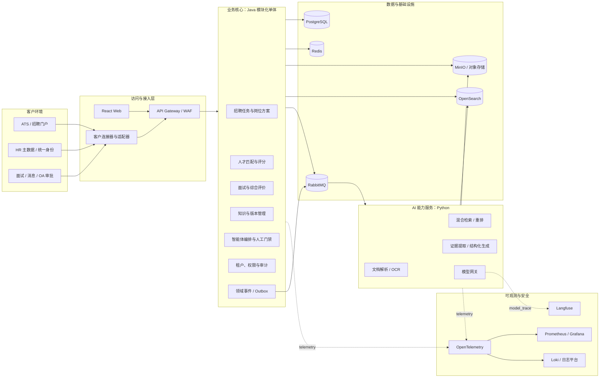
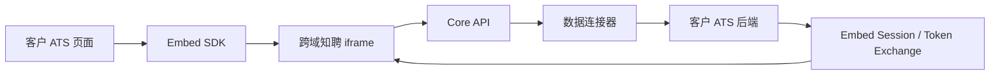
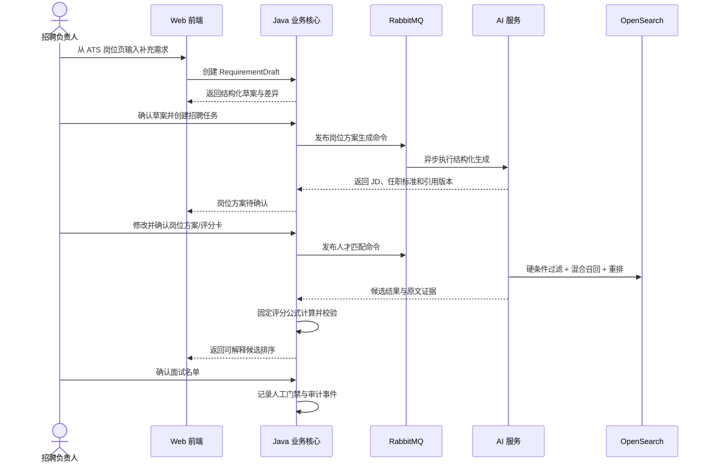
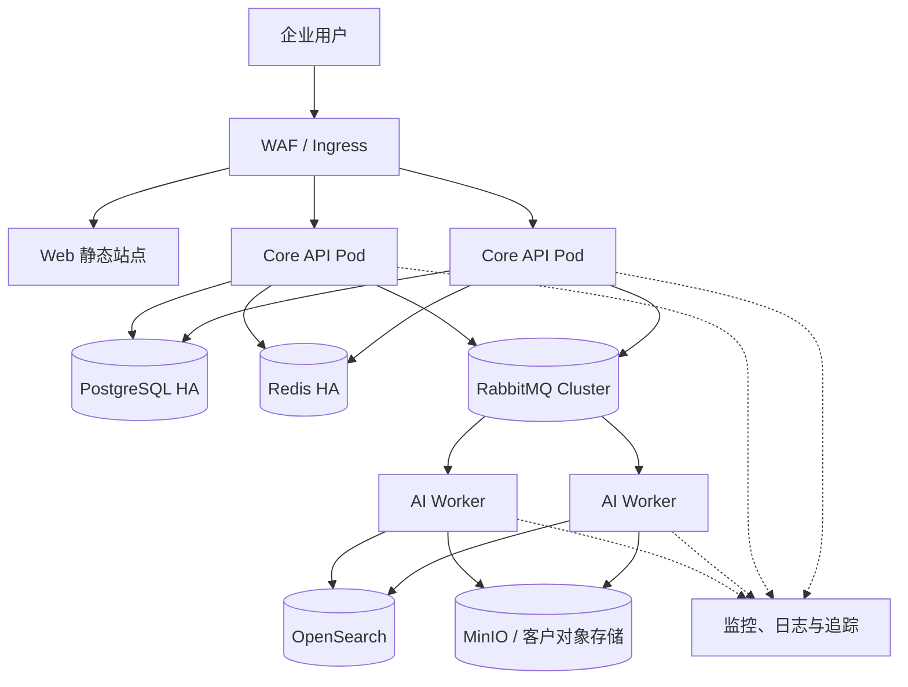

# 知聘生产系统技术架构设计

> 状态：架构基线 v0.1  
> 适用范围：从前端演示版演进到首个央国企客户生产试点  
> 关联文档：[领域模型](./domain-model.md)

## 1. 建设目标

知聘是一套当前以独立 Web 工作台为生产主形态的受控招聘智能体平台。系统围绕招聘任务，完成岗位方案生成、企业知识、独立简历库、人才检索与匹配、名单确认、推荐报告和运行审计；ATS 嵌入与在线面试平台适配在核心闭环验收后实施。

生产版本必须满足以下原则：

1. **人工掌握决策权**：岗位发布、候选名单、淘汰、录用和 Offer 审批必须经过有权限的人员确认。
2. **规则决定分数**：AI 负责提取和归纳证据，固定评分卡负责计算分数；信息不足时标记“待核实”，不得自动补全事实。
3. **结论可追溯**：推荐与评价能够追溯到简历原文、面试原文、评分卡版本、知识版本、模型版本和人工修改记录。
4. **客户系统可替换**：ATS、简历库、在线面试、消息和审批系统通过适配器接入，核心领域不依赖某一家供应商接口。
5. **租户数据隔离**：所有业务数据、知识索引、对象文件和审计记录均以租户为安全边界。
6. **先模块化单体，后按压力拆分**：首期避免过早微服务化，但 AI 推理、异步任务和外部连接器保持独立伸缩边界。

## 2. 架构范围与边界

### 2.1 平台负责

- 招聘任务、岗位方案、评分卡、人工确认和业务状态机。
- 候选人及简历的租户内映射、检索、匹配结果和证据链。
- 面试计划、邀请状态、结果回收和综合评价。
- 企业知识的上传、解析、版本、发布、检索和引用。
- 智能体运行编排、模型调用、重试、补偿和全链路审计。
- 客户系统连接配置、数据同步和标准领域事件。

### 2.2 平台不替代

- 客户 ATS 中已有的正式编制、审批、Offer 和入职主数据流程。
- 客户统一身份、组织和权限主数据；平台只同步或映射。
- 在线面试供应商的视频采集与存储能力。
- 人类对候选人的最终判断。

## 3. 总体架构



UI 嵌入与后端数据连接是两个独立集成面：



iframe 是 UI、依赖和数据隔离边界；SDK 只负责会话引导、宿主上下文、主题、导航和 MessageChannel，不保存业务状态。完整协议见[ATS 宿主嵌入契约](../api/embed-contract.md)。

## 4. 应用与模块边界

### 4.1 Web 前端

推荐技术栈：React、TypeScript、Vite、React Router、TanStack Query、Zod、Vitest、React Testing Library 和 Playwright。

前端按业务域拆分为 `tasks`、`role-plans`、`talent`、`interviews`、`evaluations`、`knowledge`、`agent-runs`、`audit` 和 `admin`。业务模块通过 `ShellAdapter` 运行在 `EmbedShell`、`StandaloneProductionShell` 或 `StandaloneDemoShell`；Shell 只改变认证、宿主上下文、导航、主题和数据 adapter。前端只负责交互状态，不保存业务事实；OpenAPI 生成 API Client 和类型。当前 `localStorage` 演示模式保留为独立 mock adapter，并在构建时与生产包隔离。

### 4.2 Java 业务核心

确定技术栈：Java 21、Spring Boot 4.0.x、Spring Security、Spring Modulith 2.0、jOOQ、Flyway、Bean Validation、Resilience4j。Spring Boot 与 Spring Modulith 的主版本属于架构基线，升级前必须通过 ADR、依赖兼容和回归测试评审。

当前 `apps/core-api/` 除安全、数据与模块化地基外，已完成 G1“需求草案 -> 人工确认 -> 招聘任务”、G2“岗位方案 -> 版本修改 -> 人工批准”和 G3“候选输入 -> 标准化简历版本 -> 硬条件过滤 -> 固定评分与证据”纵向切片。实现包含幂等、乐观锁、租户隔离、敏感字段加密、确认哈希、AgentRun、MatchRun、逐项 ResumeVersion 证据和人工确认记录；前端 G1-G3 页面已接入这些服务。G2/G3 当前均为确定性引擎，不调用 LLM、RAG 或企业知识检索。名单确认、推荐报告、知识检索、真实身份/权限和 PostgreSQL 生产实例仍未实现，因此尚不构成完整生产招聘智能体；ATS 与在线面试当前仅保留接口契约。

首期采用单一部署单元，但代码与数据库访问必须按模块约束：

| 模块 | 责任 | 禁止事项 |
| --- | --- | --- |
| `identity` | 租户、组织、用户、角色和外部身份映射 | 不自建客户密码体系 |
| `recruitment` | 招聘任务、岗位方案、评分卡和任务状态机 | 不直接调用模型 |
| `talent` | 候选人、简历引用、匹配运行、固定规则评分 | 不写入客户 ATS 主数据 |
| `interview` | 面试批次、邀请、结果和评价 | 不承担视频存储 |
| `knowledge` | 文档元数据、版本、发布和引用 | 不在事务中执行解析 |
| `agent` | 运行编排、步骤、人工门禁和策略校验 | 不绕过领域服务写业务表 |
| `integration` | 数据连接器、Embed 会话、同步任务、Webhook、Outbox | 不向核心暴露供应商字段；不持久化审计事实，只发布审计事件 |
| `audit` | 不可变审计事件、导出与合规查询 | 不允许业务接口修改历史记录 |

模块之间通过应用服务和领域事件协作，禁止跨模块直接更新数据表。需要拆分时，以模块边界迁移为服务边界。

### 4.3 Python AI 服务

推荐技术栈：Python 3.12、FastAPI、Pydantic、Celery + RabbitMQ、Tika、MinerU/PaddleOCR、BGE embedding 和 reranker。

AI 服务仅提供能力，不拥有招聘业务状态：

- 文档解析、分段、OCR、敏感信息识别和索引构建。
- 查询改写、关键词与向量混合召回、重排。
- 从简历或面试文本中提取结构化证据。
- 生成 JD、问题建议和评价草稿。
- 对输出执行 JSON Schema、引用存在性和内容安全校验。

所有请求必须携带 `tenant_id`、`trace_id`、业务资源版本和提示词版本；输出只返回结构化结果与证据定位，不直接改变业务状态。

### 4.4 模型网关

模型网关向上提供 OpenAI-compatible API，向下支持外部 API、国产云模型和客户私有化模型（如 Qwen、DeepSeek + vLLM）。其责任包括：

- 按租户和场景路由模型，限制允许的数据出口。
- 统一鉴权、超时、重试、熔断、限流和成本配额。
- 记录模型、参数、提示词模板版本、输入摘要、输出摘要和 token 用量。
- 对敏感字段执行可配置脱敏；严禁将未授权的真实简历发往公网模型。
- 支持模型回退，但回退后必须保留实际模型标识，不能伪装为同一模型。

## 5. 数据存储分工

| 组件 | 用途 | 关键约束 |
| --- | --- | --- |
| PostgreSQL | 业务事实、状态机、版本、权限、审计元数据 | 所有租户表含 `tenant_id`；Flyway 管理变更 |
| Redis | 短时缓存、分布式锁、限流、一次性令牌 | 不作为业务事实来源；键必须含租户前缀 |
| MinIO | 原始简历、知识文件、解析产物、导出报告 | 租户独立 bucket 或前缀；服务端加密和短期签名 URL |
| OpenSearch | 中文全文、向量、元数据过滤、证据片段索引 | 每次查询强制租户过滤；索引可从主数据重建 |
| RabbitMQ | 解析、索引、匹配、通知和同步任务 | 消费至少一次；消费者必须幂等并配置死信队列 |

PostgreSQL 是业务事实源。OpenSearch、Redis 和派生文件均可依据数据库与原始对象重建。

## 6. 核心执行链路

### 6.1 创建任务到确认候选名单



### 6.2 异步一致性

- 业务事务与 Outbox 事件在同一 PostgreSQL 事务中提交。
- 发布器将 Outbox 事件投递 RabbitMQ；失败可重试，不回滚已确认的业务事实。
- 消费者以 `message_id + handler_name` 建立消费幂等记录。
- HTTP/SDK 重放使用短期传输幂等键；调用外部系统同时以 `tenant_id + connector_id + operation + business_key` 建立数据库业务唯一约束，该约束在业务有效期内不因传输记录到期而失效。
- Webhook 先验签、落原始事件，再异步处理；重复事件返回成功但不重复执行业务动作。
- 超过重试阈值进入死信队列和人工异常工作台，禁止静默丢弃。

### 6.3 Java 与 Celery 消息边界

Java Core 不生成 Celery 私有 task protocol。跨运行时使用平台消息信封，Python `ai-dispatcher` 消费命令、写 Inbox 后，以稳定 `businessKey` 投递 Celery；Worker 完成后由结果发布器转换回平台结果事件，Core 再通过 Inbox 消费。

```json
{
  "messageId": "uuid",
  "type": "EvidenceExtractionRequested",
  "schemaVersion": "1.0",
  "tenantId": "tenant-001",
  "aggregate": { "type": "AgentRun", "id": "...", "version": 3 },
  "correlationId": "...",
  "causationId": "...",
  "traceparent": "00-...",
  "businessKey": "task/run/step/input-hash",
  "occurredAt": "2026-07-30T14:30:00+08:00",
  "payloadRef": "object://encrypted-payload"
}
```

- 命令交换器为 `smartai.ai.commands`，结果交换器为 `smartai.ai.results`，routing key 包含动作和主 Schema 版本；正文和简历不直接进入 RabbitMQ。
- 平台投递重试只负责“命令是否被 dispatcher 幂等接收”；Celery 重试只负责无外部副作用的计算任务。两层不得同时重放同一副作用。
- Dispatcher 以 `messageId + handler` 去重，以 `businessKey` 复用 Celery task ID；结果事件也使用稳定业务键并由 Core Inbox 去重。
- 无法解析的 Schema、权限/版本冲突和重试耗尽分别进入命令 DLQ、Celery 失败队列或结果 DLQ，并由对应服务负责人处理；不得互相自动搬运形成循环重试。

## 7. 人才检索与评分架构

匹配流水线固定为：

1. 按岗位方案版本冻结硬条件和评分卡。
2. 通过学历、地点、必备证照等可配置规则过滤。
3. BM25 中文全文检索与向量检索并行召回。
4. 使用 reranker 对合并候选集重排。
5. AI 按评分项提取证据，返回原文位置、来源和置信度。
6. Java 核心按固定权重、封顶和缺失规则计算分数及推荐等级。
7. 规则校验敏感属性、歧视风险和证据完整性。
8. 保存本次运行的输入快照、模型版本、索引版本和评分卡版本。

姓名、性别、民族、年龄、照片、婚育、健康等受保护或非岗位相关属性默认不进入评分特征。客户确有合法业务要求时，必须通过合规配置、用途说明和授权审批开启。

## 8. 客户系统集成

### 8.1 标准连接器契约

连接器将供应商模型转换为平台标准模型，至少覆盖：

- `PositionPort`：创建、更新、发布和关闭岗位。
- `CandidatePort`：分页同步候选人和简历版本。
- `ApplicationPort`：读取和回写候选人应聘阶段。
- `InterviewPort`：创建邀请、查询状态和回收结果。
- `MessagePort`：短信、邮件、企业消息和模板发送。
- `ApprovalPort`：发起审批并接收审批结果。
- `IdentityPort`：同步组织、用户、角色和岗位权限。

每个连接器申明能力集、字段映射、限流策略和数据方向。不支持的能力应明确返回 `UNSUPPORTED_CAPABILITY`，不能以成功空结果代替。

### 8.2 接入方式

- 首选客户内网 API 或消息接口。
- 支持客户主动调用平台 API、平台轮询、Webhook 和文件交换。
- 文件交换必须使用加密传输、校验和、批次号和错误明细。
- RPA 只能作为遗留系统临时方案，需隔离账户、录屏/日志和人工补偿，不能作为长期主路径。

## 9. 多租户、身份与权限

首期采用共享应用、共享数据库逻辑隔离；高敏客户支持独立数据库、独立 OpenSearch 索引和独立对象存储部署。

- 每个请求从已验证身份中解析 `tenant_id`，禁止接受前端自由指定租户。
- PostgreSQL 使用应用层租户拦截器，并启用 Row Level Security 作为第二道防线。
- OpenSearch 查询由服务端注入租户过滤；MinIO 使用租户 bucket/prefix 和独立密钥策略。
- 支持 OIDC、SAML 2.0 或 LDAP 对接客户统一身份，短期令牌使用 OAuth 2.1/OIDC。
- ATS 嵌入优先使用 OAuth 2.0 Token Exchange 或受信用户断言创建单次 Embed Grant；iframe 访问令牌仅存内存，不依赖第三方 Cookie。
- 有效权限为嵌入令牌 scope、平台 RBAC/数据范围、资源权限、宿主能力、连接器能力和人工门禁的交集；宿主传入角色不能授权。
- 权限采用 RBAC + 数据范围：角色决定动作，组织、任务归属和候选池决定数据范围。
- 关键操作需要重新鉴权或二次确认，包括导出简历、批量外发、淘汰、录用和权限变更。

基础角色包括招聘 HR、招聘负责人、用人经理、面试官、知识管理员、系统管理员和审计员；同一用户可在不同组织拥有不同角色。

## 10. 安全与合规基线

### 10.1 数据保护

- 全链路 TLS；数据库、对象存储、备份和消息持久化均加密。
- 姓名、电话、证件号、邮箱等敏感字段分类分级、按需脱敏和字段级访问控制。
- 密钥与连接凭据存放在 Vault/KMS 或客户指定密钥系统，不进入代码、配置仓库和普通日志。
- 生产、测试和演示环境严格隔离；非生产环境不得复制未脱敏真实简历。
- 提供数据保留策略、候选人授权记录、删除/匿名化任务和导出审批。

### 10.2 AI 安全

- 检索到的文件内容视为不可信数据，不能覆盖系统策略或调用工具。
- 工具调用使用白名单、最小权限和参数 Schema；外部写操作必须经过业务权限与人工门禁。
- 输入输出经过敏感信息、提示注入、恶意文件和不合规内容检测。
- 提示词模板、模型路由和评分规则均版本化并进入变更审批。
- 评价页面明确展示“AI 辅助”，保留申诉、复核和人工纠正路径。

### 10.3 审计

审计记录覆盖登录、查询、导出、业务状态变更、知识引用、模型调用、规则命中、人工确认和外部系统写入。审计事件追加写，业务用户不可修改；高合规部署可按日生成哈希链并归档到只读存储。

### 10.4 嵌入安全

- 平台按 `EmbedClient` Origin 白名单生成精确 CSP `frame-ancestors`；宿主 CSP 使用精确 `frame-src`，CORS 不使用通配符。
- Embed 路由移除会阻断跨域嵌入的 `X-Frame-Options: DENY/SAMEORIGIN`，不使用 `ALLOW-FROM`；祖先策略只由 CSP 控制。iframe 固定使用 `sandbox="allow-scripts allow-forms allow-downloads allow-same-origin"` 并禁止顶层导航。
- 设置 `Referrer-Policy: strict-origin-when-cross-origin`；Permissions Policy 默认禁用摄像头、麦克风、定位和非必要剪贴板权限。
- 一次性引导令牌不进入 URL、Cookie、日志或本地存储；`postMessage` 禁止 `targetOrigin="*"`，握手后使用 MessageChannel。
- iframe 使用固定容器高度和单一内部滚动区，避免宿主与插件双滚动；小屏转为宿主内全屏或独立窗口。

## 11. 可观测性

所有 Web 请求、消息和模型调用贯穿同一 `trace_id`，同时带 `tenant_id`、`task_id`、`agent_run_id`，日志中不得记录简历全文。

| 类型 | 工具 | 重点指标 |
| --- | --- | --- |
| Trace | OpenTelemetry | 接口、消息、检索、模型和连接器完整链路 |
| Metrics | Prometheus + Grafana | 延迟、错误率、队列堆积、检索耗时、模型成本 |
| Logs | Loki 或客户日志平台 | 结构化业务日志、安全日志、连接器错误 |
| AI Observability | Langfuse | 提示词版本、模型参数、质量评价、token 和成本 |
| Alerting | Alertmanager | SLO、死信、同步中断、权限异常和预算超限 |

关键 SLI 包括嵌入初始化成功率、上下文映射失败率、任务创建成功率、匹配作业完成时长、证据覆盖率、外部邀约成功率、人工修改率、推荐接受率和模型结构化输出通过率。

## 12. 部署拓扑与环境



- 当前 Core API 地基本地验证必须显式启用 `local` profile。Windows 在 `apps/core-api` 执行 `.\mvnw.cmd -Dspring.profiles.active=local test` 或 `.\mvnw.cmd -Dspring-boot.run.profiles=local spring-boot:run`；Linux/macOS 执行 `./mvnw -Dspring.profiles.active=local test` 或 `./mvnw -Dspring-boot.run.profiles=local spring-boot:run`。
- 目标本地开发环境：后续由 Docker Compose 启动 PostgreSQL、Redis、MinIO、OpenSearch、RabbitMQ 和观测组件；当前 local profile 仅用于工程地基验证，不代表这些依赖已完成联调。
- 集成测试：独立命名空间与匿名化测试数据，连接器使用 sandbox 或 mock server。
- 生产：必须显式启用 `production` profile；缺少 `SMARTAI_DATABASE_URL`、运行时账号 `SMARTAI_DATABASE_RUNTIME_USERNAME/PASSWORD` 或迁移账号 `SMARTAI_DATABASE_MIGRATION_USERNAME/PASSWORD` 时启动必须 fail fast，禁止回退到 local/H2。目标部署为 Kubernetes + Helm，Core API 和 AI Worker 独立扩容；数据库优先采用客户批准的托管或高可用方案。
- 私有化部署：支持离线镜像仓库、私有模型、客户 CA、客户日志与密钥系统。
- ATS 与知聘使用独立 Origin，优先采用客户子域或独立产品域；按租户配置 `frame-ancestors`、SDK 固定版本/SRI 和独立窗口降级。
- 发布：GitHub Actions 或客户 CI 构建签名镜像，经依赖扫描、SAST、测试和审批后逐环境推进；数据库迁移必须向后兼容并可独立回滚应用。

## 13. 可用性、性能与容灾目标

首个生产试点建议目标：

| 指标 | 目标 |
| --- | --- |
| 核心 API 月可用性 | 不低于 99.9% |
| 嵌入壳初始化 P95 | 不高于 3 s；上下文映射准确率 100% |
| 普通查询 P95 | 不高于 500 ms（不含外部系统和模型） |
| 20 万份租户简历 Top 200 召回 P95 | 不高于 3 s |
| 异步匹配任务 | 95% 在 5 分钟内完成，前端可查看进度 |
| RPO / RTO | 不高于 15 分钟 / 2 小时 |
| 审计覆盖率 | 关键操作 100% |
| 推荐证据覆盖率 | 每个非零评分项 100% 有来源或明确标记人工输入 |

容量测试必须使用与客户规模相符的中文简历、并发任务和知识文档，不能用空接口压测替代。

## 14. 测试策略

- 领域单元测试：状态机、评分公式、权限、版本和幂等约束。
- 模块集成测试：使用 Testcontainers 验证 PostgreSQL、RabbitMQ、OpenSearch 和对象存储交互。
- 契约测试：对每个客户连接器建立 provider/consumer contract 和回放样例。
- AI 评价集：固定匿名样本验证提取准确率、证据定位、格式通过率、偏差和提示注入防护。
- 端到端测试：Playwright 覆盖创建任务到评价确认的主路径和异常补偿路径。
- 宿主测试：宿主 Harness 与真实 ATS 沙箱覆盖三种 Shell、关闭重开、路由切换、第三方 Cookie 禁用、协议不兼容和双滚动。
- 安全测试：依赖扫描、SAST/DAST、越权、租户串读、文件上传和模型工具调用测试。
- 嵌入安全测试：伪造 Origin、消息/令牌重放、跨租户上下文、点击劫持、恶意主题和宿主卸载。

## 15. 演进路线

1. **基础可运行**：前端 TypeScript 化、OpenAPI 契约、Java 核心骨架、认证、多租户、任务和审计。
2. **知识与匹配闭环**：文档解析、索引、岗位方案、评分卡、独立简历库、混合检索、证据提取和人工名单确认。
3. **独立结果闭环**：生成版本化推荐报告，完成历史回测、安全评估、性能测试、UAT、监控与运维手册。
4. **外部协同预留**：核心闭环验收后，再接入 ATS、在线面试和消息渠道，完成 SSO、Webhook、重试与人工补偿。
5. **平台化**：形成连接器 SDK、租户配置中心和模型评测中心；只有在独立扩容或团队边界明确时拆分服务。

## 16. 必须通过 ADR 决策的事项

以下变化不得仅通过代码提交决定，需新增 Architecture Decision Record 并评审：

- 从共享库切换为租户独立库或跨地域部署。
- 引入新的公网模型或改变候选人数据出境路径。
- 将固定评分改为模型直接评分。
- 拆分模块化单体、替换消息中间件或搜索引擎。
- 改变审计数据留存、候选人数据保留或删除策略。
- 允许智能体绕过人工门禁执行岗位发布、淘汰、录用或 Offer 操作。
- 改变 iframe 隔离边界、嵌入身份协议、宿主消息协议或允许直接 DOM 注入。
