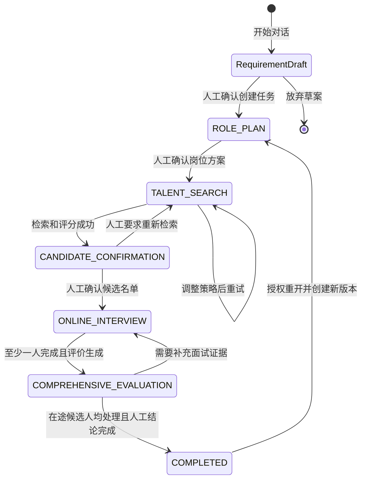
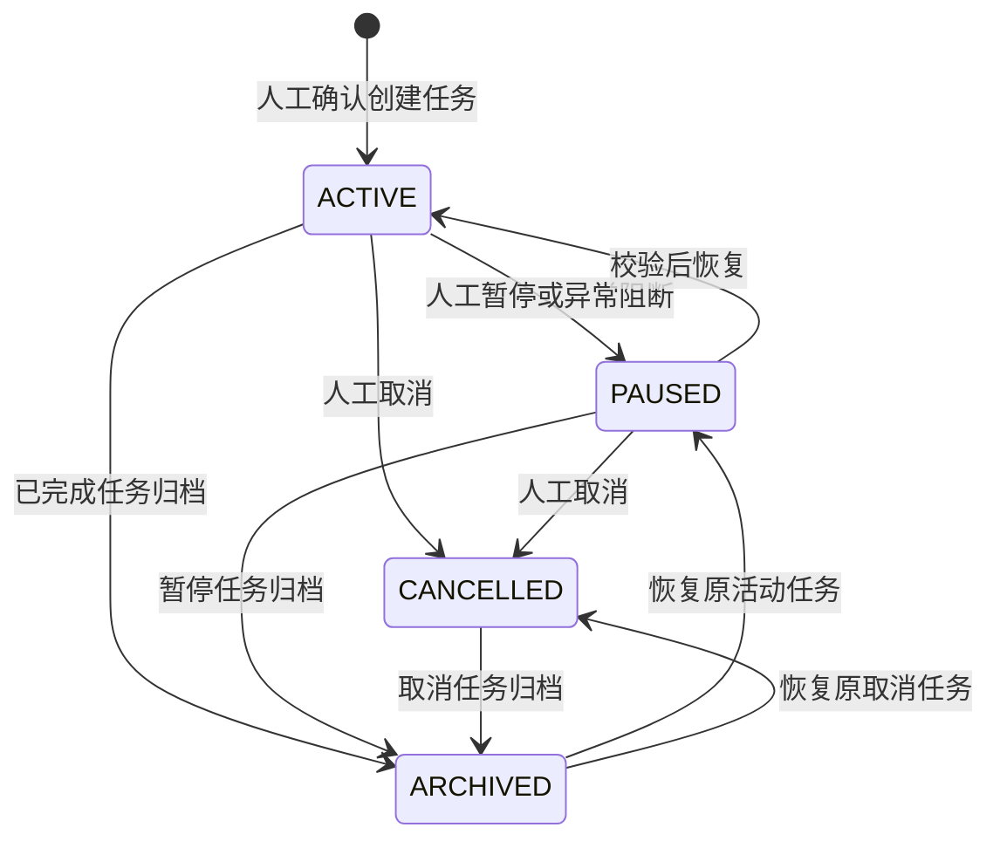

# 招聘任务工作流与状态机

> 文档状态：产品基线  
> 适用对象：产品、前端、后端、AI、测试、实施和运维  
> 关联文档：[产品需求文档](./PRD.md)

## 1. 设计目的

本文定义招聘任务从需求输入到结果回流的唯一业务状态机，并明确每个状态的输入、输出、自动动作、人工门禁、失败处理、重试、取消和回退规则。

生产系统必须以服务端状态为准。前端只能请求合法命令和展示事件，不得自行推导或直接修改关键业务状态。

所有嵌入式命令先解析并冻结 `HostContextSnapshot`。打开或关闭侧栏、切换 ATS 内全页工作区、宿主路由变化和 iframe 隐藏均不是业务状态迁移，也不取消服务端任务。上下文中的外部资源引用必须在服务端重新映射和鉴权。

## 2. 三层状态模型

业务阶段、暂停归档和技术失败不能混成一组互斥状态，任务采用三层状态模型。

### 2.1 业务阶段 `business_stage`

| 枚举 | 页面名称 | 含义 |
| --- | --- | --- |
| `ROLE_PLAN` | 岗位方案 | 任务已创建，岗位方案待生成、编辑或确认 |
| `TALENT_SEARCH` | 人才搜索 | 使用已确认方案检索和评分候选人 |
| `CANDIDATE_CONFIRMATION` | 名单确认 | 推荐结果已产生，等待人工选择和确认名单 |
| `ONLINE_INTERVIEW` | 在线面试 | 名单已确认，邀请、提醒和结果回收进行中 |
| `COMPREHENSIVE_EVALUATION` | 综合评价 | 至少一份结果已回收，等待逐人确认评价结论 |
| `COMPLETED` | 已完成 | 当前任务的候选人处理和结果回流已完成 |

当前演示中的六个招聘阶段与以上枚举一一对应。

### 2.2 生命周期 `lifecycle_status`

| 枚举 | 含义 |
| --- | --- |
| `ACTIVE` | 任务正常推进 |
| `PAUSED` | 暂停启动新自动动作，保留当前业务阶段 |
| `CANCELLED` | 任务终止，不再推进，已有外部动作按补偿规则处理 |
| `ARCHIVED` | 列表和保留状态，记录归档前业务阶段及生命周期 |

`COMPLETED` 是业务阶段而不是归档。归档不表示任务成功，取消也不等于删除。

### 2.3 步骤执行状态 `execution_status`

| 枚举 | 含义 |
| --- | --- |
| `IDLE` | 当前没有执行中的自动步骤 |
| `QUEUED` | 已进入异步队列 |
| `RUNNING` | 正在执行 |
| `WAITING_HUMAN` | 等待人工确认或补充 |
| `SUCCEEDED` | 当前步骤成功 |
| `FAILED_RETRYABLE` | 可自动或人工重试 |
| `FAILED_FINAL` | 重试耗尽或不可重试，等待人工处理 |
| `CANCEL_REQUESTED` | 已请求取消，等待执行器安全停止 |
| `CANCELLED` | 当前执行已停止 |

例如“人才搜索 + 执行失败”仍属于人才搜索阶段，不应跳出业务页面。

## 3. 主状态机

取消、暂停和归档由独立生命周期状态机控制，不写入 `business_stage`：

- `ACTIVE -> PAUSED`：停止尚未开始的自动动作，保留阶段和上下文。
- `PAUSED -> ACTIVE`：校验依赖和版本后从原阶段恢复。
- `ACTIVE/PAUSED/CANCELLED -> ARCHIVED`：从默认列表隐藏；`ACTIVE -> ARCHIVED` 仅允许 `business_stage=COMPLETED`。
- `ARCHIVED -> 原生命周期`：恢复可见；原活动任务先以暂停状态恢复，由用户显式继续。
- 取消时保留原 `business_stage`，并按第 8 节执行外部动作补偿。

## 4. 状态总表

| 业务状态 | 必要输入 | 自动动作 | 主要输出 | 人工门禁 | 正常下一状态 |
| --- | --- | --- | --- | --- | --- |
| 需求草案（创建前） | 自然语言、来源需求 | 字段提取、缺失提示、默认值建议 | 可核对结构化草案 | 确认创建或放弃 | `ROLE_PLAN` |
| `ROLE_PLAN` | 已确认需求、有效知识、模板 | 生成 JD、标准、硬条件、评分卡、阈值和引用 | 岗位方案草稿版本 | 确认方案，发布另设审批 | `TALENT_SEARCH` |
| `TALENT_SEARCH` | 冻结方案、人才库范围、检索策略 | 硬过滤、召回、重排、证据提取、规则评分和质检 | 结果版本与运行报告 | 异常或降级需人工处理 | `CANDIDATE_CONFIRMATION` |
| `CANDIDATE_CONFIRMATION` | 推荐结果、证据、待核实项 | 汇总展示，不外部联系 | 候选名单草稿 | 确认名单，至少一人 | `ONLINE_INTERVIEW` |
| `ONLINE_INTERVIEW` | 已确认名单、模板、期限和连接器 | 建批次、发送、提醒、同步、回收结果 | 状态、结果、转写和异常 | 取消、补发、补录需人工 | `COMPREHENSIVE_EVALUATION` |
| `COMPREHENSIVE_EVALUATION` | 简历、面试、测评、规则和人工意见 | 汇总证据、固定公式、草拟报告 | 综合评价版本 | 逐人确认推进、保留或不进入 | `COMPLETED` |
| `COMPLETED` | 所有候选人终态及人工结论 | 结果回写、指标汇总、归档建议 | 结果包和审计链 | 重开需负责人授权 | 保持或重开 |

## 5. 状态详细规则

### 5.1 需求草案（创建前）

**进入条件**：用户从 ATS 岗位页唤起助手、进入对话创建，或从 ATS 导入授权需求。若相同来源岗位和招聘轮次已有活动任务，直接恢复该任务而不是新建草案。

**输入**

- 必填意图：明确岗位名称。
- 建议字段：部门、地点、人数、招聘类型、核心要求、优先级、计划完成时间、知识范围。
- 上下文：用户、组织、来源系统、来源需求编号和模板。

ATS 岗位字段与 HR 自然语言冲突时，草案必须并列展示来源、差异和待确认值，不能静默覆盖 ATS 主数据。

**自动动作**

1. 解析自然语言并映射结构化 Schema。
2. 标记缺失、冲突和低置信度字段。
3. 生成可编辑草案及默认值说明。

**输出**：结构化草案、置信度、缺失项和原始输入快照。

**人工门禁**：用户必须看到并确认草案；岗位名称不明确时禁止确认。

**退出规则**

- 确认：创建任务编号、写入审计、进入 `ROLE_PLAN`。
- 取消：删除临时草案或按配置短期保留，不产生正式任务。

### 5.2 `ROLE_PLAN` 岗位方案

**进入条件**：招聘需求已人工确认并创建正式任务。

**输入**：需求版本、岗位和组织上下文、已发布知识、JD 模板、制度约束和评分卡模板。

**自动动作**

1. 校验知识权限和有效期。
2. 检索历史 JD、岗位标准、人才画像和制度流程。
3. 生成 JD、职责、任职标准、硬条件、评分维度、权重、阈值和引用。
4. 校验权重总和、阈值连续性、禁用属性和必填字段。

**输出**：岗位方案草稿、生成说明、知识引用、规则校验结果和差异版本。

**人工门禁**

- 招聘负责人确认岗位方案后才可检索人才。
- 客户要求岗位发布时，应完成客户审批后执行，不能以方案确认代替发布审批。

**迁移规则**

- 确认：固化方案和全部依赖版本，进入 `TALENT_SEARCH` 并创建检索运行。
- 保存未确认：保持 `ROLE_PLAN + WAITING_HUMAN`。
- 需求重大变化：生成新需求版本并重新生成方案，旧草稿保留。

### 5.3 `TALENT_SEARCH` 人才搜索

**进入条件**：方案已确认，人才库连接器、检索索引和权限检查通过。

**输入**：冻结方案、硬条件、评分卡、阈值、检索范围、候选人数据版本和运行参数。

**自动动作**

1. 执行学历、资质、地点等明确硬条件过滤。
2. 进行关键词与向量混合召回。
3. 使用可配置模型重排候选集合。
4. 从简历原文提取评分证据和待核实项。
5. 使用固定公式计算分项分、总分和等级。
6. 校验证据覆盖、重复候选人、权限和结果完整性。

**输出**：结果版本、排名、分项分、原文证据、排除原因、待核实项、运行统计和降级说明。

**人工门禁**：正常检索无需逐步确认；检索范围变化、评分规则变化、知识降级、无结果或敏感数据异常必须人工处理。

**迁移规则**

- 成功并通过质检：进入 `CANDIDATE_CONFIRMATION`。
- 无结果：保持本状态并标记 `WAITING_HUMAN`，允许调整范围或方案后重试。
- 策略调整：生成新运行版本，不覆盖旧结果。

### 5.4 `CANDIDATE_CONFIRMATION` 名单确认

**进入条件**：至少一次人才搜索运行成功并完成质检。

**输入**：结果版本、候选人详情、证据、排除记录、待核实项和用户权限。

**自动动作**：根据筛选和排序展示结果并记录结果版本；不自动选人、不发送邀请、不写人工结论。

**输出**：名单草稿、选中原因或备注、确认人和名单版本。

**人工门禁**

- 至少选择一位候选人。
- 确认前明确下一步会联系候选人及渠道、模板和截止时间。
- 客户配置会签时，按规则完成 HR 和用人经理/招聘负责人会签。

**迁移规则**

- 确认名单：冻结名单，进入 `ONLINE_INTERVIEW` 并创建面试批次。
- 要求重搜：进入 `TALENT_SEARCH` 创建新运行，旧名单草稿作废但保留审计。
- 修改方案：回到 `ROLE_PLAN` 创建新版本，之前结果标记过期。

### 5.5 `ONLINE_INTERVIEW` 在线面试

**进入条件**：名单已确认，面试工具、消息渠道、模板和截止时间校验通过。

**输入**：名单版本、候选人联系授权、面试模板、批次、截止时间、消息模板和连接器。

**自动动作**

1. 为每位候选人创建独立执行记录和幂等键。
2. 调用面试系统建面试并发送邀请。
3. 同步送达、查看、作答、完成、过期、拒绝、取消和异常状态。
4. 按频率策略提醒未完成候选人。
5. 回收结果、转写和附件，完成映射、完整性校验和结构化处理。

**候选人级状态**

`DRAFT -> PENDING_SEND -> SENT -> DELIVERED -> OPENED -> IN_PROGRESS -> COMPLETED`

终态或异常状态：`EXPIRED`、`DECLINED`、`CANCELLED`、`FAILED`。发送失败统一记为 `FAILED` 并写入 `failure_code=DELIVERY_FAILED`；结果校验失败写入 `InterviewResultVersion.validity_status=INVALID`，不另造面试执行状态。

**输出**：面试批次、候选人状态、发送凭证、提醒、结果、转写、结构化评价和异常。

**人工门禁**

- 名单确认即为正常邀请发送授权。
- 更换联系方式、绕过频率限制补发、人工补录和取消已发送邀请须确认并填写原因。

**迁移规则**

- 至少一人完成且结果有效：生成其综合评价，任务进入 `COMPREHENSIVE_EVALUATION`。
- 其他候选人可继续并行面试；进入评价不代表批次全部结束。
- 全部过期/拒绝/失败且无人完成：保持本状态，等待延长、补发、追加名单或人工关闭。

### 5.6 `COMPREHENSIVE_EVALUATION` 综合评价

**进入条件**：至少一位已确认名单候选人拥有校验通过的面试结果。

**输入**：简历版本、匹配证据、面试结果与转写、测评、人工意见、评分规则和权重。

**自动动作**

1. 汇总各来源证据和分数。
2. 依据固定公式计算综合分和建议等级。
3. 识别事实冲突、证据不足和待追问项。
4. 草拟综合评价说明和脱敏报告。

**输出**：综合评价版本、分项构成、原文证据、风险项、模型建议和报告草稿。

**人工门禁**：有权限人员逐人确认“进入下一轮”“保留复核”或“不进入”；最终录用和 Offer 进入客户既有审批流程。

**迁移规则**

- 证据不足：回到 `ONLINE_INTERVIEW` 创建补充环节，原评价标记待更新。
- 结论确认：保留人工结论版本并回写允许字段。
- 所有在途候选人均可关闭且人工结论完成：进入 `COMPLETED`。

“可关闭”指：已完成且结论确认，或已过期/拒绝/取消并由 HR 明确关闭。

### 5.7 `COMPLETED` 已完成

**进入条件**：所有在途候选人可关闭，要求的人工结论已完成，待回写动作成功或已转人工补偿。

**自动动作**：生成结果包、指标、审计摘要和知识/规则使用记录，幂等回写 ATS 允许字段。

**输出**：只读结果、候选人结论、回写状态、完整审计链和优化指标。

**人工门禁**：重开须招聘负责人授权并说明原因。

**重开规则**

- 默认从 `ROLE_PLAN` 创建新方案版本，避免沿用过期规则和候选人数据。
- 仅补处理某位候选人的外部回写时，不改变业务阶段，只创建补偿任务。

## 6. 人工门禁

| 门禁 | 触发位置 | 必要信息 | 有权角色 | 确认后固化内容 |
| --- | --- | --- | --- | --- |
| `G1` 创建任务 | 需求草案 | 结构化需求、缺失项、默认值、来源 | 招聘 HR/负责人 | 任务编号、初始需求版本 |
| `G2` 确认方案 | `ROLE_PLAN` | JD、硬条件、评分卡、阈值、知识引用 | 负责人或授权 HR | 方案及依赖版本 |
| `G3` 发布岗位 | 客户要求时 | 渠道、时间、审批状态、公开内容 | 客户审批人 | 发布内容和外部记录 |
| `G4` 确认名单 | `CANDIDATE_CONFIRMATION` | 结果版本、候选人、证据、邀请计划 | 负责人或授权 HR | 名单和发送授权 |
| `G5` 确认结论 | `COMPREHENSIVE_EVALUATION` | 分项分、证据、风险、模型建议 | 负责人或授权 HR | 人工结论版本 |
| `G6` 录用/Offer | 客户后续流程 | 客户审批材料 | 客户指定审批人 | 不由知聘自动完成 |

门禁事件记录确认人、代理关系、时间、输入版本、意见、客户端和请求标识。撤销确认必须创建新版本或补偿，不覆盖历史。

确认按钮必须与待确认正文同页可见，不能只显示“等待确认”或要求先跳到另一模块。`G1` 同页展示原需求、解析字段、默认值和冲突；`G2` 展示 JD、硬条件、评分卡、阈值、知识版本及相对上一版变更；`G4` 展示候选人、关键证据、待核实项、邀请渠道/模板/期限和外部影响；`G5` 展示分项分、证据、风险、模型建议和待写入的人工结论。侧栏空间不足时可无损打开 ATS 内全页工作区，但必须保留任务、对象、草稿版本和返回位置。

## 7. 失败与重试

### 7.1 通用原则

1. 技术失败不改变业务阶段，只改变 `execution_status`。
2. 自动重试只用于明确可重试且幂等的动作；权限、数据质量和业务校验失败不能盲目重试。
3. 重试沿用业务幂等键，生成新尝试编号并保留错误链。
4. 候选人联系和外部写入结果未知时，先查询下游状态再决定是否重试。
5. 自动重试耗尽后进入 `FAILED_FINAL` 并生成带上下文的人工待办。
6. 用户可见失败步骤、影响范围、已完成动作和建议，不只看到“系统异常”。

### 7.2 默认策略

- 网络超时、限流、临时不可用：最多 3 次，建议间隔 1、5、15 分钟并加随机抖动。
- 模型 Schema 失败：最多 2 次定向修复；仍失败则人工处理或切换已批准备用模型。
- 文档解析失败：按文件重试 2 次；不阻塞其他文件，失败文件不进入可用知识。
- 认证失败、权限拒绝、Schema 不兼容、数据违规：不自动重试，通知管理员。
- 批量任务按候选人或文档隔离失败，不因少数失败重跑整个批次。

### 7.3 典型失败矩阵

| 步骤 | 场景 | 自动重试 | 处理规则 |
| --- | --- | --- | --- |
| 需求解析 | 缺字段或 Schema 错误 | 最多 2 次 | 失败后展示原文并要求人工补充 |
| 知识检索 | 无命中、过期、无权限 | 否 | 提示降级影响，不能静默使用通用知识 |
| 人才库读取 | 超时、游标失效 | 最多 3 次 | 从检查点继续，避免重复处理 |
| 证据提取 | 原文无法定位 | 有限重试 | 评分项标记待核实，不生成虚假引文 |
| 人才搜索 | 零结果 | 否 | 人工选择放宽范围、调整方案或追加来源 |
| 创建面试 | 超时且结果未知 | 先查后重试 | 用幂等键查下游，确认未创建后才重发 |
| 消息发送 | 退信或号码无效 | 仅临时错误 | 永久失败转人工核对，禁止循环发送 |
| 面试回调 | 重复、乱序、签名失败 | 不重试业务 | 去重并按版本合并；签名失败隔离告警 |
| 结果解析 | 文件损坏或候选人不匹配 | 有限重试 | 隔离结果，禁止生成评价，创建核对待办 |
| 综合报告 | 说明生成失败 | 最多 2 次 | 固定分保留，报告待生成，不伪造说明 |
| ATS 回写 | 超时、冲突、接口失败 | 最多 3 次 | 使用版本和幂等键，冲突转人工决策 |

## 8. 暂停、取消与归档

### 8.1 暂停

- 招聘 HR 或负责人可暂停活动任务。
- 暂停后不再启动新的检索、提醒、报告生成和回写。
- 已发出的请求不能假定停止；执行器应尽力取消并记录最终结果。
- 已发送邀请保持有效，除非另行取消；界面必须提示影响。
- 恢复前重新校验权限、知识有效期、方案、连接器和候选人数据变化。

### 8.2 取消

- 必须填写原因并二次确认影响范围。
- 不删除任务、候选人、评价或审计记录。
- 未发生外部动作时直接停止排队和运行任务。
- 已发布岗位、发送邀请或回写状态时，创建撤下岗位、取消邀请或变更通知等补偿任务。
- 补偿失败不阻塞进入 `CANCELLED`，但保留“补偿未完成”待办和告警。
- 已确认人工结论保留历史语义，不因取消被篡改。

### 8.3 归档与恢复

- 归档是列表与保留管理，不是业务完成或删除。
- 归档活动任务前系统先暂停，并明确显示在途外部动作。
- 恢复后回到原业务阶段；原活动任务以 `PAUSED` 恢复，用户检查后显式继续。
- 归档数据仍受保留期、权限、搜索和审计规则约束。

## 9. 回退与补偿

### 9.1 原则

- 回退不删除历史版本、不修改已发生审计事件。
- 尚未产生外部副作用时，可回到上个门禁并创建新版本。
- 已产生外部副作用时不做“假回退”，而是创建可追踪补偿动作。
- 候选人已收到的信息无法撤回时，记录事实并通过合适渠道通知变更。

### 9.2 规则表

| 当前阶段 | 允许目标 | 条件 | 处理 |
| --- | --- | --- | --- |
| `ROLE_PLAN` | 需求草案 | 正式任务保留 | 创建需求修订并重新生成，不删除任务 |
| `TALENT_SEARCH` | `ROLE_PLAN` | 停止当前运行 | 旧运行过期，新方案确认后重搜 |
| `CANDIDATE_CONFIRMATION` | `TALENT_SEARCH` | 调整策略 | 新建搜索和结果版本 |
| `CANDIDATE_CONFIRMATION` | `ROLE_PLAN` | 岗位标准变化 | 旧结果全部过期 |
| `ONLINE_INTERVIEW` | `CANDIDATE_CONFIRMATION` | 仅未发送候选人 | 未发送记录取消；已发送走取消邀请补偿 |
| `COMPREHENSIVE_EVALUATION` | `ONLINE_INTERVIEW` | 需补充证据 | 新建补充面试，不覆盖已有结果和评价 |
| `COMPLETED` | `ROLE_PLAN` | 负责人授权重开 | 新建任务周期和方案版本，历史完成记录只读 |

## 10. 并发、幂等与一致性

- 状态命令包含 `task_id`、期望版本 `expected_version`、命令编号和操作者上下文。
- 服务端仅在版本和允许迁移匹配时提交；冲突返回最新状态，不做最后写入覆盖。
- 创建任务、确认方案、确认名单、创建面试、发送消息、回收结果和 ATS 回写均使用稳定幂等键。
- 侧栏和全页工作区沿用同一 `taskId`、活动资源、草稿版本和命令 ID；宿主导航或关闭面板不取消运行。
- 上下文令牌过期、资源不存在、权限变化或宿主协议不兼容时禁止提交，清空旧对象并提供刷新、返回或独立打开入口。
- 只有未保存的本地编辑触发离开确认；后台完成后可通过 ATS 通知中心或插件徽标提示，不依赖面板持续打开。
- 回调按来源事件编号去重；无编号时使用业务键、状态、版本和时间窗口组合去重。
- 乱序回调不得让候选人从 `COMPLETED` 回退到 `IN_PROGRESS`；修订必须使用更高版本事件。
- 状态提交同时写业务事件和审计事件，使用事务消息或 Outbox 保证最终一致。

## 11. 超时、升级与人工接管

| 场景 | 默认建议 | 系统动作 | 升级对象 |
| --- | --- | --- | --- |
| 岗位方案待确认 | 2 个工作日 | 站内提醒，保留草稿 | 招聘 HR -> 负责人 |
| 名单待确认 | 1 个工作日 | 提醒结果可能随人才库变化 | 招聘 HR -> 负责人 |
| 面试未送达 | 30 分钟 | 查询渠道，失败生成待办 | 招聘 HR/实施支持 |
| 候选人未作答 | 按截止时间 | 按配置提醒，不超过频率上限 | 招聘 HR |
| 自动步骤运行 | 按步骤 SLA | 标记超时，安全取消或转失败 | 技术支持/管理员 |
| 外部回写失败 | 重试耗尽 | 创建补偿待办，保留待同步 | 招聘 HR + 集成管理员 |

参数按租户和招聘类型配置。人工接管入口展示已完成步骤、待处理对象、推荐动作和外部影响。

## 12. 事件与审计

每个状态迁移至少产生一条不可变业务事件，包括：

- 事件编号、类型、租户、组织、任务、候选人或批次。
- 迁移前后状态、任务版本和触发命令。
- 操作者类型、用户/服务账号、代理授权、时间和客户端。
- 输入对象、知识、规则、提示、模型和连接器版本。
- 外部业务键、幂等键、追踪标识和结果摘要。
- 人工意见、失败代码、重试次数、补偿状态和数据分级。

审计界面应按任务重建时间线，并区分智能体动作、固定规则计算、外部事件、人工决策和管理员操作。

## 13. 前端与 API 约束

- 导航可保持当前演示的六阶段业务表达。
- 工作台进度和智能体动态来自服务端事件流或轮询，不能用计时器假装推进。
- 关键动作提交时携带命令编号；网络重试不得产生第二条业务命令。
- `WAITING_HUMAN` 必须在当前页面直接展示待确认内容和入口，不能只显示“等待确认”。
- `FAILED_RETRYABLE` 和 `FAILED_FINAL` 展示错误摘要、影响对象、重试/接管入口和审计链接。
- 前端不得依据本地勾选、面试结果或评价直接标记任务完成，须由服务端校验。

## 14. 状态机验收用例

1. 未确认岗位方案时启动人才搜索，服务端拒绝并保持 `ROLE_PLAN`。
2. 两人同时确认不同方案版本，仅当前版本成功，另一请求收到冲突和最新版本。
3. 人才搜索零结果时不进入名单确认，提供调整范围和重试入口。
4. 未选择候选人确认名单，系统拒绝且不创建面试批次。
5. 名单确认重复提交，外部面试和邀请各只创建一次。
6. 邀请调用超时但下游已创建，系统查询确认后不得重复发送。
7. 重复或乱序面试回调不会导致状态倒退或重复评价。
8. 无有效面试结果时进入综合评价，系统拒绝并指向面试协同。
9. 综合评分缺少证据时标记待核实，不生成虚假引文。
10. 模型建议不能直接成为人工推进或淘汰结论。
11. 暂停后不发送新提醒，已发送邀请保持真实状态并提示影响。
12. 取消已发送面试会创建补偿动作，补偿失败形成独立待办。
13. 归档活动任务后以暂停状态恢复，未经继续不得自动执行。
14. 已确认结论修改时产生新版本，原结论和原因仍可审计。
15. 在途候选人未处理完时不得进入 `COMPLETED`。
16. 完成任务重开后从新方案版本推进，不覆盖历史完成周期。
17. 从同一 ATS 岗位重复唤起助手时恢复活动任务，不重复创建任务。
18. 从候选人 A 切换到候选人 B 时，旧数据立即清空且不得串人展示。
19. 面板关闭、宿主路由改变或侧栏切到全页后，后台任务继续且选择状态可恢复。
20. 过期、篡改或跨租户的宿主上下文被拒绝并写入审计。
21. 无知识管理权限的业务用户只能查看当前任务引用，不能修改知识版本。
22. `G1/G2/G4/G5` 页面未展示规定的正文、版本和外部影响时，确认按钮不可用；长内容切到全页后上下文不丢失。

以上用例应覆盖 API、领域服务、异步执行器和端到端界面测试。
